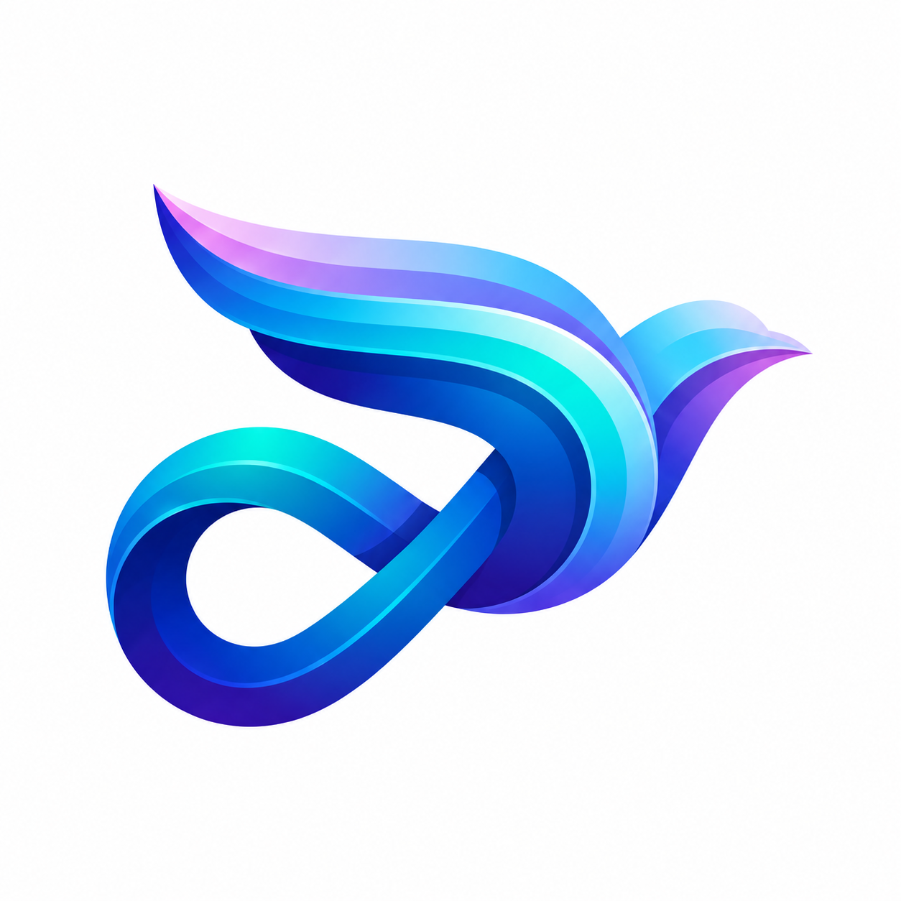

<p align="center">
  <picture>
    <source media="(prefers-color-scheme: dark)" srcset="docs/brand/maxly-logo-black.png">
    <source media="(prefers-color-scheme: light)" srcset="docs/brand/maxly-logo-white.png">
    
  </picture>
</p>

<h1 align="center">Maxly Core</h1>

<p align="center">Ядро Maxly на Kotlin Multiplatform: клиент протокола MAX для iOS, Android и Desktop.</p>

<p align="center"><a href="https://t.me/maxly_client">Канал новостей Maxly</a></p>

<p align="center">
  
  
  
  
  
  
  
  
  <a href="https://github.com/fighxy/maxly-core/actions/workflows/ios-core.yml"></a>
</p>

Нативное сетевое ядро мессенджера Max на **Kotlin Multiplatform**.

Цель — переносимый клиентский core (протокол, TLS-транспорт, сессия, авторизация),
который можно подключать к Android, iOS и desktop без дублирования логики.
Архитектура опирается на два референса:

- [KometTeam/kolibri](https://github.com/KometTeam/kolibri) — Rust-ядро: бинарный
  фрейминг, MessagePack, LZ4/Zstd, TLS-сессия, handshake / ping / reconnect,
  медиа-загрузки и сигналинг звонков.
- [MaxApiTeam/PyMax](https://github.com/MaxApiTeam/PyMax) — Python-клиент с
  типизированными payload'ами и полным списком опкодов.

Сетевое ядро реализовано: протокол, TLS-транспорт с reconnect, сессия, вход,
API чатов/сообщений/пользователей/аккаунта/медиа, события и локальное состояние,
фасад `MaxClient` в `:shared`. Опкоды без подтверждённой схемы не реализованы
(см. [docs/opcodes.md](docs/opcodes.md#блокеры-нужен-снятый-трафик)).

Клиент всегда представляется Android-устройством (профиль Pixel 8,
`DeviceProfile.android`); данные iOS-устройства никогда не отправляются.

## Название и идентификаторы

Проект называется **Maxly** (репозиторий `fighxy/maxly-core`, Gradle `rootProject` — `maxly-core`, `group = "com.maxly"`).
Пакеты Kotlin — `com.maxly.*`. iOS-фреймворк — статический `MaxlyCore` (`import MaxlyCore` в Swift;
`./gradlew :ios:assembleMaxlyCoreReleaseXCFramework` → `ios/build/XCFrameworks/release/MaxlyCore.xcframework`).
Классы `MaxClient`, `MaxState`, `MaxEvent`, `MaxError`, `MaxIosClient` и другие названы по протоколу MAX и не переименованы.
Идентификаторы хранилищ остались прежними, чтобы сохранённые сессии пережили обновление: Keychain `com.max.kmp.<namespace>`,
SharedPreferences `max_kmp_*`, каталог `~/.max-kmp` (свойство `max.kmp.dir`), ключи `max.<namespace>.*`.

## Стек

- Kotlin Multiplatform
- kotlinx-coroutines
- транспорт — raw TLS через `java.net.Socket`/`javax.net.ssl` (JVM/Android) и Apple Network.framework (iOS; прокси — iOS 17+)
- медиа-HTTP: OkHttp (JVM/Android), `NSURLSession` (iOS)
- MessagePack — собственный кодек на чистом Kotlin (`DefaultMessagePackCodec`)

## Модули

| Модуль | Назначение |
|--------|------------|
| [`core`](core/) | Общий KMP-код: протокол (фрейминг, опкоды, MessagePack, LZ4/Zstd), транспорт (TLS, прокси), сессия (handshake, ping, reconnect), авторизация, `MaxApi`, медиа, события (`MaxEvents`, `EventRouter`), состояние (`MaxStore`), классификация ошибок (`MaxError`) |
| [`shared`](shared/) | Публичный фасад для всех платформ: `MaxClient` (connect, вход, API, события, медиа, store), хранилище учётных данных (`PlatformSession`: Keychain / SharedPreferences / файл), низкоуровневый `Session` |
| [`android`](android/) | Android-таргет, JNI-обёртки (если понадобится нативный слой) |
| [`ios`](ios/) | iOS-таргет, cinterop к C ABI |
| [`desktop`](desktop/) | Desktop (Compose Multiplatform) для Windows / Linux / macOS |

## Таргеты

- Android
- iOS (`iosArm64`, `iosSimulatorArm64`)
- JVM / Desktop

## Статус

| Область | Состояние |
|---------|-----------|
| протокол, транспорт, сессия | готово: фрейминг, MessagePack, LZ4/Zstd, TLS (JVM/Android — `javax.net.ssl`, iOS — Network.framework), ping, reconnect с backoff |
| вход | SMS, пароль 2FA (115), регистрация, вход по токену с sync-маркерами, LOGIN2, logout, подтверждение QR (290) |
| API | сообщения (текст, вложения, отложенные, опросы, комментарии, реакции), чаты и группы, пользователи, аккаунт (профиль, приватность, папки, сессии), 2FA, боты, токен звонков (158) |
| медиа | фото/файлы/видео/voice/video note, потоковая загрузка с диска (`UploadSource`), параллельная загрузка видео, прогресс |
| события и состояние | `MaxEvents` → `EventRouter` → `MaxStore` (чаты, сообщения, пользователи, presence), поиск дыр истории после reconnect и их догрузка |
| ошибки | `Throwable.toMaxError()` → `ErrorKind` (сеть, авторизация, лимит, сервер, ...) с признаком retry |
| блокеры | стикеры (81), «печатает» (65), поиск, 193/194/301, большинство опкодов звонков — нужен снятый трафик |

Проверка: JVM-тесты (`:core:jvmTest`, `:shared:jvmTest`); iOS-код компилируется и тестируется
только в GitHub CI (`.github/workflows/ios-core.yml`), там же собираются Android-таргеты.

### Использование

```kotlin
// Android: один раз в Application.onCreate
PlatformSession.init(applicationContext)

val client = MaxClient(MaxClientConfig())
client.start()                                   // AwaitingAuth или Ready (есть сохранённый токен)
val code = client.requestCode("+79990000000")
when (val r = client.verifyCode(code.token, "123456")) {
    is VerifyResult.LoggedIn -> Unit              // токен сохранён, store заполнен
    is VerifyResult.PasswordRequired -> client.checkPassword(r.trackId, password)
    is VerifyResult.RegistrationRequired -> client.register(r.registerToken, "Имя")
}
client.router.on<MaxEvent.NewMessage> { println(it.message.text) }
client.watchStore { state -> render(state.chats) }
client.sendText(chatId, "привет")
val photo = client.media.uploadPhoto(path)        // потоково с диска
client.media.sendMessage(chatId, listOf(photo), text = "фото")
```

## Документация

- [docs/protocol.md](docs/protocol.md) — архитектура протокола Max (референс kolibri / PyMax).
- [docs/opcodes.md](docs/opcodes.md) — реализованные опкоды, конфликты имён, блокеры (payload unknown), calls.
- [docs/architecture.md](docs/architecture.md) — раскладка модулей и классов KMP-ядра.
- [docs/ios-plan.md](docs/ios-plan.md) — план iOS-клиента на Swift (этап 1).

## Лицензия

MIT — см. [LICENSE](LICENSE).
