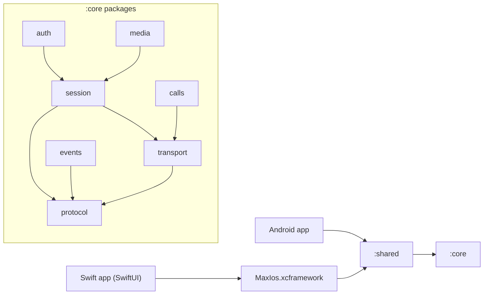

# Архитектура max-kmp-core (Kotlin Multiplatform)

> **Рекомендация / план, не факт.** Протокольные факты — в [protocol.md](protocol.md) (с цитатами на kolibri `a6cdce9` и PyMax `origin/dev/2.5.0`). Здесь — раскладка модулей и классов ядра. Эскиз сигнатур P0 — в [protocol.md §J](protocol.md#j-рекомендуемая-модульная-раскладка-max-kmp-core); здесь он не дублируется, а дополняется.
>
> **Стартовая платформа — iOS (Swift)**, затем Android. План iOS-клиента: [ios-plan.md](ios-plan.md).

## 1. Gradle-модули (существующие)

| Модуль | Роль | iOS-артефакт |
|--------|------|--------------|
| `:core` | протокол, транспорт, сессия, auth, media, calls | framework `MaxCore` (static), `core/build.gradle.kts` |
| `:shared` | публичный API (`ru.max.shared.Session`), `api(project(":core"))` | framework `MaxShared` (static) |
| `:ios` | iOS-мост (`ru.max.ios.IosBridge`), cinterop `maxc.def` (пока TODO) | framework `MaxIos` (static) |
| `:android` | Android-обёртки (`NativeBridge.kt`) | — |
| `:desktop` | JVM/Compose | — |

## 2. Направление зависимостей



Правило: пакеты нижнего уровня (`protocol`) ничего не знают о верхних; `session` не знает про `auth`/`media`; UI-платформы видят только `:shared` (и то, что `:ios` экспортирует).

## 3. Пакеты и классы (P0/P1/P2)

| Пакет | Класс / файл | P | Назначение (см. protocol.md) |
|-------|--------------|---|------------------------------|
| `ru.max.core.protocol` | `Framing.kt`: `Framing`, `Packet`, `Cmd`, `PacketReceiver` | P0 | 10-байтный заголовок, reassembly (§B.1–B.2) |
| | `Compression.kt` (новый) | P0 | LZ4-block out ≥32 B, sniff Zstd/LZ4-frame/LZ4-block in (§B.4) |
| | `Opcodes.kt`: `Opcodes`, `name()` | P0 | union kolibri ∪ PyMax (§E) |
| | `MessagePack.kt`: `MessagePackCodec`, `MsgValue` | P0 | payload (§F.3) |
| `ru.max.core.transport` | `TlsTransport.kt`: `TlsTransport`, `TransportConfig` | P0 | TLS TCP, timeouts 15/30 s (§B.6) |
| | `Dispatcher.kt` (новый) | P0 | seq→pending, `cmd 1/2/3` = ответ, `cmd 0` = push (§B.7) |
| | `ProxyConnector.kt` (новый) | P1 | HTTP CONNECT / SOCKS5 (§B.8) |
| | `TrustStore.kt` (новый, expect/actual) | P1 | opt-in Минцифры CA (§B.6, §K14) |
| `ru.max.core.session` | `SessionMachine.kt`: `SessionMachine`, `SessionState` | P0 | handshake 6, состояния (§C.1–C.2) |
| | `HandshakeConfig.kt` / `UserAgent` (новый) | P0 | поля `userAgent` (§C.2) |
| | `PingScheduler.kt` (новый) | P0 | PING 1, 30 s, `interactive` (§C.3) |
| | `ReconnectPolicy.kt` (новый) | P0 | backoff 2/4/8/15 s (§C.4) |
| `ru.max.core.events` | `EventBus.kt` (новый): `SharedFlow<Packet>` + типизированные `CoreEvent` | P0 | pushes 128 `NOTIF_MESSAGE`, 129, 130, 137… (§E) |
| `ru.max.core.auth` | `AuthService.kt` (новый), `ChatCacheFingerprint` | P0 | AUTH_REQUEST→AUTH→LOGIN, пароль 115 (§C.5, §D.1–D.2) |
| | `QrAuth.kt` (новый) | P1 | 288/289/291 (§D.3) |
| | `TokenStore` (interface, actual: Keychain / EncryptedSharedPreferences) | P0 | хранение login token |
| `ru.max.core.api` | `ChatsApi`, `MessagesApi` (новые) | P0 | `CHATS_LIST` 53, `CHAT_HISTORY` 49, `MSG_SEND` 64 |
| `ru.max.core.media` | `MediaUploader.kt` (новый) | P1 (video parallel — P2) | §G |
| `ru.max.core.calls` | `CallSignaling.kt`, `Vcp` (новые) | P2 | §H |
| `ru.max.shared` | `Session.kt` (фасад), `MaxClient` (новый) | P0 | единая точка для Swift/Android |

## 4. Source sets

```text
core/src/
  commonMain/kotlin/ru/max/core/{protocol,transport,session,events,auth,api,media,calls}
  iosMain/kotlin/ru/max/core/     # actual: TLS (Ktor darwin / Network.framework), TrustStore, TokenStore (Keychain)
  androidMain/kotlin/ru/max/core/ # actual: TLS (Ktor okhttp / sockets), TrustStore, TokenStore
  jvmMain/kotlin/ru/max/core/     # desktop / тесты
shared/src/
  commonMain/kotlin/ru/max/shared/  # Session, MaxClient, DTO для UI
  iosMain/ androidMain/ jvmMain/    # PlatformSession.kt (уже есть)
ios/src/
  iosMain/kotlin/ru/max/ios/        # IosBridge: Swift-friendly обёртки (callbacks/Flow → Swift)
  nativeInterop/cinterop/maxc.def   # только если появится внешняя C-библиотека
```

Всё протокольное — в `commonMain`; в `iosMain`/`androidMain` — только `actual` для сокета/TLS, хранилища секретов и корней доверия.

## 5. Граница экспорта на iOS

- **Основной путь (P0):** Kotlin/Native `binaries.framework` → собрать **XCFramework** (`MaxIos` или объединённый `MaxShared`) и подключить в Xcode/SPM. Swift вызывает Objective-C-совместимый API, сгенерированный Kotlin/Native; `suspend` → completion/async, `Flow` → адаптер в `IosBridge` (callback/`AsyncStream` на стороне Swift).
- **cinterop + `maxc.def`:** направление обратное — даёт Kotlin доступ к **внешней C-библиотеке** (например, если бы транспорт/кодек был взят из Rust C ABI). `maxc.def` сейчас — заглушка (`headers`/`staticLibraries` закомментированы). Для чисто-Kotlin ядра не нужен; держать P2/опционально.
- Экспортировать только `ru.max.shared` + `ru.max.ios` (не весь `core`), чтобы API для Swift был узким и стабильным.

Подробно (включая Swift-обёртки) — [ios-plan.md §1–2](ios-plan.md).

## 6. Порядок работ

1. **P0 iOS:** protocol → transport(+Dispatcher) → session(+Ping/Reconnect) → auth(SMS, пароль) → api(chats/messages) → EventBus → shared/ios export → Swift-клиент ([ios-plan.md](ios-plan.md)).
2. **P0 Android:** те же `commonMain`, `androidMain` actual'ы, Android UI.
3. **P1:** proxy, Минцифры trust, QR, MediaUploader (photo/file), LOGIN2, push-регистрация (после эксперимента §K).
4. **P2:** video parallel upload, CallSignaling, stories (EXPERIMENTAL), desktop.

Открытые протокольные вопросы, влияющие на ядро (cmd=2, исходящее сжатие, поля handshake, 158) — [protocol.md §K](protocol.md#k-открытые-вопросы).
