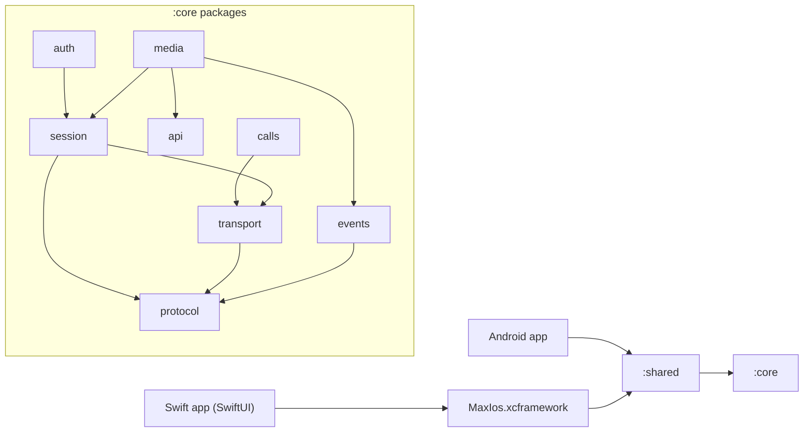

# Архитектура max-kmp-core (Kotlin Multiplatform)

> **Рекомендация / план, не факт.** Протокольные факты — в [protocol.md](protocol.md) (с цитатами на kolibri `a6cdce9` и PyMax `origin/dev/2.5.0`). Здесь — раскладка модулей и классов ядра. Эскиз сигнатур P0 — в [protocol.md §J](protocol.md#j-рекомендуемая-модульная-раскладка-max-kmp-core); здесь он не дублируется, а дополняется.
>
> **Стартовая платформа — iOS (Swift)**, затем Android. План iOS-клиента: [ios-plan.md](ios-plan.md).

## 1. Gradle-модули (существующие)

| Модуль | Роль | iOS-артефакт |
|--------|------|--------------|
| `:core` | протокол, транспорт, сессия, auth, media, calls | framework `MaxCore` (static), `core/build.gradle.kts` |
| `:shared` | публичный API (`com.max.shared.Session`), `api(project(":core"))` | framework `MaxShared` (static) |
| `:ios` | iOS-мост (`com.max.ios.IosBridge`), cinterop `maxc.def` (пока TODO) | framework `MaxIos` (static) |
| `:android` | Android-обёртки (`NativeBridge.kt`) | — |
| `:desktop` | JVM/Compose | — |

## 2. Направление зависимостей



Правило: пакеты нижнего уровня (`protocol`) ничего не знают о верхних; `session` не знает про `auth`/`media`; UI-платформы видят только `:shared` (и то, что `:ios` экспортирует).

## 3. Пакеты и классы (P0/P1/P2)

| Пакет | Класс / файл | P | Назначение (см. protocol.md) |
|-------|--------------|---|------------------------------|
| `com.max.core.protocol` | `Framing.kt`: `Framing`, `Packet`, `Cmd`, `PacketReceiver` | P0 | 10-байтный заголовок, reassembly (§B.1–B.2) |
| | `Compression.kt` (новый) | P0 | LZ4-block out ≥32 B, sniff Zstd/LZ4-frame/LZ4-block in (§B.4) |
| | `Opcodes.kt`: `Opcodes`, `name()` | P0 | union kolibri ∪ PyMax (§E) |
| | `MessagePack.kt`: `MessagePackCodec`, `MsgValue` | P0 | payload (§F.3) |
| `com.max.core.transport` | `TlsTransport` / `MaxTransport`, `TransportConfig` | P0 | TLS TCP, timeouts 15/30 s, ping, reconnect (§B.6, §C.3–C.4) |
| | `RawConnection` / `ConnectionFactory` (expect/actual) | P0 | платформенный сокет: JVM/Android `java.net.Socket`+`javax.net.ssl`; iOS — Network.framework (`NetworkFrameworkConnectionFactory`, прокси через `nw_proxy_config` на iOS 17+) |
| | `PendingRequests` / `SeqCounter` / `PacketReassembler` | P0 | seq→pending, `cmd 1/2/3` = ответ, `cmd 0` = push (§B.7) |
| | `ProxyConfig` / `ProxyHandshake` | P0 | HTTP CONNECT / SOCKS5 / SOCKS5h (§B.8) |
| | `MincifryCa` (embedded PEM) | P0 | Root+Sub CA Минцифры; `trustMincifryCa=true` по умолчанию (§B.6) |
| `com.max.core.session` | `SessionMachine.kt`: `SessionMachine`, `SessionState`; `SessionConfig.kt`: `SessionConfig`, `DeviceInfo`, `UserAgentInfo`; `HandshakePayload.kt`: `HandshakePayload`, `HandshakeInfo` | P0 | handshake `SESSION_INIT` (6) поверх `MaxTransport` (hook `onConnected`, повторяется после каждого reconnect); `StateFlow` состояний `Disconnected → Connecting → Handshaking → Online`, `Reconnecting`, `Closed`, `Failed(cause)`; hook `afterHandshake` (token-login через `auth.TokenLogin`), сам auth — вне session; `FatalSessionError` из hook останавливает reconnect (§C.1–C.2) |
| | `HandshakeConfig.kt` / `UserAgent` (новый) | P0 | поля `userAgent` (§C.2) |
| | `PingScheduler.kt` (новый) | P0 | PING 1, 30 s, `interactive` (§C.3) |
| | `ReconnectPolicy.kt` (новый) | P0 | backoff 2/4/8/15 s (§C.4) |
| `com.max.core.events` | `MaxEvent.kt`: sealed `MaxEvent`; `EventParser.kt`: `EventParser`; `MaxEvents.kt`: `MaxEvents` (`Flow<MaxEvent>` поверх `SessionMachine.pushes` / `MaxTransport.pushes`) | P0 | маппинг как в PyMax `dispatch/mapping.py`: 128/67 → `NewMessage` / `MessageEdited` / `MessagesDeleted` (по `status`), 142 → `MessagesDeleted`, 135 → `ChatUpdated`, 129 → `Typing`, 130 → `MessageRead`, 132 → `Presence`, 155 → `ReactionsChanged`, 136 → `AttachmentReady` (`fileId` / `videoId` / `audioId`, как PyMax `resolve_attach`); остальное (`cmd != 0`, 136 без известного id) → `Unknown`; ack не отправляется (в references его нет) (§E) |
| `com.max.core.auth` | `Auth.kt`: `AuthApi`, `RequestSink`, `CodeRequest`, `VerifyResult`, `SyncState`, `LoginResult`, `InvalidTokenException`; `TokenLogin.kt`; `Fingerprint.kt`: `ApkFingerprint`; `Sha256.kt` | P0 | `AUTH_REQUEST` (17) → `AUTH` (18) → `LOGIN` (19) по PyMax/kolibri; `TokenLogin.hook` логинится после каждого handshake; fingerprint = 3×SHA-256(digest‖callsSeed(int64 BE)‖deviceId); 2FA-пароль (115, `AuthApi.checkPassword`) и регистрация (23, `AuthApi.confirmRegistration`) завершают вход; `PasswordRequired` и `RegistrationRequired` — промежуточные результаты `AUTH` 18 (§C.5, §D.1–D.2) |
| | `Auth.kt`: `AuthApi.approveQrLogin`, `QrApproval` | P0 | подтверждение web-входа по QR с залогиненного Android-устройства: `AUTH_QR_APPROVE` (290) `{qrLink}` (PyMax `ApproveQrLoginPayload`); сам вход по QR (288/289/291) в references есть только у web-клиента PyMax — не реализован (§D.3) |
| | хранение токена в `shared`: `KeychainKeyValueStore`, Android `SharedPreferences` (`MODE_PRIVATE`, `commit()`), JVM `FileKeyValueStore` | P0 | login token; `EncryptedSharedPreferences` нет |
| `com.max.core.api` | `MaxApi.kt`: `MaxApi` (фасад); `MessagesApi.kt`: `MessagesApi`, `ClientIdGenerator`; `ChatsApi.kt`: `ChatsApi`; `ApiModels.kt`: `MaxMessage`, `Chat`, `ChatHistory`, `ReadState`, `ReactionInfo`, `ChatMember(sPage)`, `MalformedReplyException` | P0 | только request/response поверх `RequestSink` (залогиненный `SessionMachine`): `MSG_SEND` 64 (текст, reply, forward), `MSG_GET` 71, `MSG_EDIT` 67, `MSG_DELETE` 66, `CHAT_HISTORY` 49, `CHAT_MARK` 50, pin через `CHAT_UPDATE` 55, реакции 178/179/180; `CHAT_INFO` 48, `CHATS_LIST` 53, `CHAT_MEMBERS` 59, `CHAT_LEAVE` 58, `CHAT_DELETE` 52 — payload-ы как в PyMax `api/messages`, `api/chats`; текст уходит как есть, с сырыми `elements` (Markdown не разбирается); есть отложенная отправка, опросы, комментарии и управление группами (создание, ссылки, участники, админы, заявки); вложения — в `media` |
| `com.max.core.media` | `MediaApi.kt`: `MediaApi`; `MediaHttp.kt`: `MediaHttp` (interface `request(method, url, headers, body, progress)`), `UploadProgress`, `HttpResponse`, `UploadRequests`; `Attachments.kt`: sealed `OutgoingAttachment` (`Photo`/`File`/`Video`/`Voice`/`VideoNote`/`Poll`/`Contact`), sealed `Attachment` (`Photo`/`Video`/`File`/`Audio`/`Sticker`/`Unknown`), `MaxMessage.attachments`; `MediaModels.kt`: `OutgoingMedia` (путь + `PHOTO`/`VIDEO`/`FILE`), `PhotoUploadSlot`, `UploadSlot`, `VideoLink`, `FileLink`, `UploadException` | P1 | control plane как PyMax `api/uploads/service.py`: `PHOTO_UPLOAD` 80, `FILE_UPLOAD` 87, `VIDEO_UPLOAD` 82 с `{count, type, uploaderType, profile}` (video `0/0`, voice `2/1`, video note `1/1`) → CDN (форма запросов как kolibri `media/upload.rs`: multipart `file` для фото, один POST с `Content-Range` для файлов/видео/voice/video note; UA = `UserAgentInfo.httpUserAgent`, percent-encoded) → ожидание `NOTIF_ATTACH` 136 (60 с) для file/video → `attaches` в `MSG_SEND` 64 (`MediaApi.sendMessage`; при `attachment.not.ready` — ждёт сигнал первого voice (`audioId`) / video note (`videoId`) и повторяет один раз; для фото/файлов/видео с `notReadyAttempts > 1` повторяет тот же кадр раз в `notReadyDelay` (1 с), как Komet — `MaxClient.sendAttachments` берёт 30 попыток). Контакт: `{_type: CONTACT, contactId}` (Komet `sendContactMessage`; в PyMax исходящего контакта нет). Пачка: `MediaApi.uploadAll(items, progress)` — по очереди, общий прогресс по сумме размеров файлов, `MaxClient.sendMedia` отправляет все вложения одним `MSG_SEND` с подписью. Video note: `thumbhash` из JSON CDN (base64 с `=`-паддингом), payload `{_type: VIDEO, token, videoType: 1, thumbhash?, duration?}`. Видео по частям: `uploadVideoParallel` / `uploadChunked` — kolibri `upload_video`: GET-handshake (resume offset из тела) → POST-чанки `bytes a-b/n` (2 MiB, 4 воркера — дефолты kolibri-py), `X-Uploading-Mode: parallel`, `Connection: close`, `fileName="<micros & 0x7FFFFFFF>"`. Прогресс: `UploadProgress(sent, total)` на всех загрузках (kolibri `ProgressFn`). Аудио = `Voice` (другого пути в references нет; `AUDIO_PLAY` 301 не используется). Стикеры — только входящие; `STICKER_UPLOAD` 81 в references не вызывается. Ссылки: `VIDEO_PLAY` 83, `FILE_DOWNLOAD` 88. HTTP через `MediaHttp`; по умолчанию `expect fun defaultMediaHttp(MediaHttpConfig)` (`DefaultMediaHttp.kt`: таймауты, Минцифры CA, insecure, proxy): **JVM/Android** — `OkHttpMediaHttp` (jvmAndroidShared, OkHttp 4.12: заголовки как есть, тело без media type → `Content-Type` дословно, прогресс по 64 KiB через counting `RequestBody`, отмена корутины → `Call.cancel()`, без редиректов и ретраев, trust = system + `MincifryCa` как в `JavaSocketConnectionFactory`, HTTP/SOCKS5-proxy); **iOS** — `UrlSessionMediaHttp` (`NSURLSession` с delegate: `didSendBodyData` → прогресс, `didReceiveChallenge` → system + `MincifryCa` через `NetworkFrameworkConnectionFactory.evaluateSecTrustWithMincifry`, редиректы запрещены, `task.cancel()` при отмене; `Content-Length`/`Connection`/`Host` управляет сама NSURLSession; proxy не поддержан). Проверка: JVM — end-to-end через локальный `com.sun.net.httpserver` (`OkHttpMediaHttpTest`); iOS — только type-check на Linux, компиляция и offline-тесты в macOS CI (§G) |
| `com.max.core.calls` | `CallSignaling.kt`, `Vcp` (новые) | P2 | §H |
| `com.max.core.state` | `MaxState.kt`: `MaxState`, `StateReducer`; `MaxStore.kt`: `MaxStore` | P0 | неизменяемое состояние (чаты, сообщения с лимитом на чат, пользователи, presence) поверх результатов `LOGIN`, API и событий; `historyGaps()` — чаты с открытой дырой: якорь (id локального хвоста) держится, пока страница `CHAT_HISTORY` его не содержит или сервер не вернёт пустую страницу |
| `com.max.core.events` | `EventRouter.kt`: `EventRouter` | P0 | два этапа: сборщик (`MaxClient` даёт ему `session.reliablePushes`, без потерь) применяет событие к `MaxStore` и кладёт его в неограниченную очередь; отдельная корутина вызывает типизированные обработчики (`on<T>`), ошибки обработчиков — в `onError`. Медленный обработчик не тормозит ни стор, ни чтение сокета; `stop()` из обработчика не ждёт сам себя |
| `com.max.core` | `MaxError.kt`: `MaxError`, `ErrorKind`, `Throwable.toMaxError()` | P1 | классификация сбоев (сеть, таймаут, авторизация, лимит, сервер, протокол) с `retryable` |
| `com.max.shared` | `MaxClient.kt`: `MaxClient`, `MaxClientConfig`, `ClientState`; `KeyValueStore.kt`: `KeyValueStore`, `CredentialStore`, `StoredCredentials`; `PlatformSession.kt`; `DeviceProfile.kt`; `Watch.kt`; `Session.kt` | P0 | фасад: `SessionMachine` + `TokenLogin` + `AuthApi` + `MaxApi` + `MediaApi` + `MaxEvents`/`EventRouter`/`MaxStore`; сохраняет deviceId/instanceId/токен/sync-маркеры (iOS — Keychain, Android — SharedPreferences после `PlatformSession.init(context)`, JVM — файл), после re-login листает `CHAT_HISTORY` назад, пока страница не перекроет локальный хвост или история не кончится, `watch*` для Swift; `DeviceProfile.requireAndroid` отвергает не-Android профиль |

## 4. Source sets

```text
core/src/
  commonMain/kotlin/com/max/core/{protocol,transport,session,events,auth,api,media,calls}
  iosMain/kotlin/com/max/core/     # actual: TLS (Network.framework), media HTTP (NSURLSession); TokenStore (Keychain) позже
  androidMain/kotlin/com/max/core/ # actual: java.net.Socket + javax.net.ssl, OkHttp media (shared with jvm), TokenStore позже
  jvmMain/kotlin/com/max/core/     # desktop / тесты (тот же JavaSocketConnectionFactory и OkHttpMediaHttp)
  jvmAndroidShared/kotlin/        # общий java.net / javax.net.ssl и OkHttp код (не KMP source set)
shared/src/
  commonMain/kotlin/com/max/shared/  # Session, MaxClient, DTO для UI
  iosMain/ androidMain/ jvmMain/    # PlatformSession.<platform>.kt: хранилище (Keychain / SharedPreferences / файл)
ios/src/
  iosMain/kotlin/com/max/ios/        # IosBridge: Swift-friendly обёртки (callbacks/Flow → Swift)
  nativeInterop/cinterop/maxc.def   # только если появится внешняя C-библиотека
```

Всё протокольное — в `commonMain`; в `iosMain`/`androidMain` — только `actual` для сокета/TLS, хранилища секретов и корней доверия.

## 5. Граница экспорта на iOS

- **Основной путь (P0):** Kotlin/Native `binaries.framework` → собрать **XCFramework** (`MaxIos` или объединённый `MaxShared`) и подключить в Xcode/SPM. Swift вызывает Objective-C-совместимый API, сгенерированный Kotlin/Native; `suspend` → completion/async, `Flow` → адаптер в `IosBridge` (callback/`AsyncStream` на стороне Swift).
- **cinterop + `maxc.def`:** направление обратное — даёт Kotlin доступ к **внешней C-библиотеке** (например, если бы транспорт/кодек был взят из Rust C ABI). `maxc.def` сейчас — заглушка (`headers`/`staticLibraries` закомментированы). Для чисто-Kotlin ядра не нужен; держать P2/опционально.
- Экспортировать только `com.max.shared` + `com.max.ios` (не весь `core`), чтобы API для Swift был узким и стабильным.

Подробно (включая Swift-обёртки) — [ios-plan.md §1–2](ios-plan.md).

## 6. Порядок работ

1. **P0 iOS:** protocol → transport(+Dispatcher) → session(+Ping/Reconnect) → auth(SMS, пароль) → api(chats/messages) → events (MaxEvents) → shared/ios export → Swift-клиент ([ios-plan.md](ios-plan.md)).
2. **P0 Android:** те же `commonMain`, `androidMain` actual'ы, Android UI.
3. **P1:** QR, media (`MediaApi` + платформенные `MediaHttp`; нужна живая проверка на CDN Max), push-регистрация (после эксперимента §K). `LOGIN2` (опкод 8, `AuthApi.login2`) уже вызывается. Proxy, Минцифры CA и iOS TLS (Network.framework) уже в P0-транспорте.
4. **P2:** CallSignaling, stories (EXPERIMENTAL), desktop.

Открытые протокольные вопросы, влияющие на ядро (cmd=2, исходящее сжатие, поля handshake, 158) — [protocol.md §K](protocol.md#k-открытые-вопросы).

## 7. Конвенция пакетов

- Корневой пакет — **`com.max`**. Не `ru.max` и не голый `max`. Это по аналогии с `ru.kolibri` в `kolibri-kotlin`: у библиотеки один явный корень с доменным префиксом.
- Пакет модуля задаётся как `com.max.<модуль>[.<слой>]`: `com.max.core.protocol`, `com.max.core.transport`, `com.max.shared`, `com.max.android`, `com.max.ios`, `com.max.desktop`.
- Путь к исходникам повторяет пакет: `<модуль>/src/<sourceSet>/kotlin/com/max/<модуль>/…`.
- Gradle: `group = "com.max.kmp"`. `namespace` у Android-модулей совпадает с корнем модуля (`com.max.core`, `com.max.shared`, `com.max.android`). Пакет cinterop — `com.max.ios.cinterop`.
- Экспорт на iOS: в XCFramework попадают только `com.max.shared` и `com.max.ios` (см. §5).

## 8. Целевая архитектура (план, не текущее состояние)

> Это структура, к которой мы идём. Файлы с пометкой «план» пока не существуют и появляются по мере работ (§6). Текущий скелет — в §1 и §4.

### 8.1. Дерево репозитория

```text
max-kmp-core/
├── core/                                        # KMP-ядро: протокол, сеть, сессия
│   ├── build.gradle.kts
│   └── src/
│       ├── commonMain/kotlin/com/max/core/
│       │   ├── protocol/
│       │   │   ├── Framing.kt                   # 10-байтный заголовок, сборка пакетов   P0
│       │   │   ├── Opcodes.kt                   # таблица опкодов (kolibri ∪ PyMax)       P0
│       │   │   ├── MessagePack.kt               # MessagePackCodec, MsgValue              P0
│       │   │   ├── Compression.kt               # флаг сжатия, sniff, лимит 32 MiB       P0
│       │   │   ├── Lz4.kt                       # LZ4 block + frame (pure Kotlin)         P0
│       │   │   ├── Zstd.kt                      # Zstd-декодер RFC 8878, raw/RLE-энкодер  P0
│       │   │   └── XxHash.kt                    # XXH32/XXH64 для чексумм                 P0
│       │   ├── transport/
│       │   │   ├── TlsTransport.kt              # интерфейс + TransportConfig             P0
│       │   │   ├── MaxTransport.kt              # seq, pushes, ping, reconnect            P0
│       │   │   ├── RawConnection.kt             # expect/actual фабрика сокета            P0
│       │   │   ├── ProxyConfig.kt / ProxyHandshake.kt  # HTTP CONNECT / SOCKS5            P0
│       │   │   └── MincifryCa.kt                # embedded PEM Root+Sub CA                P0
│       │   ├── session/
│       │   │   ├── SessionMachine.kt            # состояния, handshake 6, re-handshake    P0
│       │   │   ├── SessionConfig.kt             # TransportConfig + device/userAgent      P0
│       │   │   └── HandshakePayload.kt          # payload opcode 6, HandshakeInfo         P0
│       │   │       (PING каждые 30 с и backoff 2/4/8/15 с — в transport/MaxTransport.kt)
│       │   ├── auth/
│       │   │   ├── Auth.kt                      # AuthApi: SMS 17→18, LOGIN 19            P0
│       │   │   ├── TokenLogin.kt                # LOGIN 19 как afterHandshake hook        P0
│       │   │   ├── Fingerprint.kt               # ApkFingerprint (chatCacheFingerprint)   P0
│       │   │   ├── Sha256.kt                    # SHA-256 для fingerprint                 P0
│       │   │   └── (QR)                         # 290 approve в Auth.kt; 288/289/291 — web  P1
│       │   ├── api/                             # MaxApi, MessagesApi, ChatsApi, модели   P0
│       │   ├── events/                          # MaxEvent, EventParser, MaxEvents        P0
│       │   ├── media/                           # MediaApi 80/82/87 + CDN, 83/88, attaches, video note,
│       │   │                                    # parallel/resume video, progress; defaultMediaHttp (expect) P1
│       │   ├── calls/
│       │   │   └── CallSignaling.kt             # vcp → ws2 → WebRTC            (план)    P2
│       │   ├── push/
│       │   │   └── PushToken.kt                 # регистрация токена, опкод неизвестен (план) P1
│       │   └── Platform.kt
│       ├── androidMain/kotlin/com/max/core/     # actual: сокет/TLS, TokenStore, TrustStore
│       ├── iosMain/kotlin/com/max/core/         # actual: Network.framework, NSURLSession (media), Keychain
│       └── jvmMain/kotlin/com/max/core/         # actual: JVM-сокеты, тесты
├── shared/                                      # узкий публичный API
│   ├── build.gradle.kts
│   └── src/
│       ├── commonMain/kotlin/com/max/shared/    # Session.kt, MaxClient (план), DTO
│       └── {androidMain,iosMain,jvmMain}/kotlin/com/max/shared/PlatformSession.kt
├── android/                                     # Android-обёртки и приложение
│   ├── build.gradle.kts
│   └── src/main/
│       ├── AndroidManifest.xml
│       ├── jniLibs/                             # только для нативных .so (WebRTC и т. п.)
│       └── kotlin/com/max/android/NativeBridge.kt
├── ios/                                         # iOS-мост → XCFramework для Swift
│   ├── build.gradle.kts
│   └── src/
│       ├── iosMain/kotlin/com/max/ios/IosBridge.kt
│       └── nativeInterop/cinterop/maxc.def      # пакет com.max.ios.cinterop, опционально
├── iosApp/                                      # (план) Xcode-проект на SwiftUI, см. ios-plan.md
├── desktop/                                     # Compose Multiplatform (JVM)             P2
│   ├── build.gradle.kts
│   └── src/jvmMain/kotlin/com/max/desktop/Main.kt
├── docs/
│   ├── protocol.md
│   ├── architecture.md
│   └── ios-plan.md
├── gradle/libs.versions.toml
├── build.gradle.kts · settings.gradle.kts · gradle.properties
└── README.md · LICENSE · .gitignore
```

### 8.2. Таргеты и направление вызовов

```text
 iOS                            Android                         Desktop
 SwiftUI-клиент (iosApp)        Kotlin-клиент (android)         Compose Multiplatform (desktop)
        │                              │                                │
        ▼                              ▼                                ▼
 XCFramework: com.max.ios       прямой вызов Kotlin             JVM
 (Obj-C/C-интерфейс)            (JNI — только для нативных .so)
        │                              │                                │
        └───────────────┬──────────────┴────────────────┬───────────────┘
                        ▼                               ▼
                   com.max.shared  (MaxClient, Session, DTO)
                        │
                        ▼
                   com.max.core:  auth · api · media · calls · push
                        │
                        ▼
                   session ──▶ transport ──▶ protocol
                                    │
                                    ▼
                         api2.oneme.ru  (TLS TCP, MessagePack)

 Входящие события идут обратно вверх: protocol → MaxTransport.pushes → MaxEvents → Flow → (Swift: AsyncStream)
```

Порядок работ: сначала iOS, потом Android, потом Desktop (см. §6 и [ios-plan.md](ios-plan.md)).

### 8.3. Стек

| Слой | Технологии |
|------|------------|
| Ядро | Kotlin Multiplatform, Kotlin Coroutines, Kotlin Serialization, собственный MessagePack-кодек, собственные LZ4 (block/frame) и Zstd-декодер на чистом Kotlin (энкодер Zstd — только raw/RLE-блоки, без сжатия). Транспорт: raw TLS через `java.net.Socket`/`javax.net.ssl` (JVM/Android), Apple Network.framework (iOS). Медиа-HTTP: OkHttp (JVM/Android), `NSURLSession` (iOS); Ktor убран из зависимостей (транспорту нужен сырой TLS-поток, `ktor-network-tls` на Native в 3.1.1 — stub; медиа хватает OkHttp/NSURLSession без зависимостей в commonMain). |
| iOS | SwiftUI, async/await, `AsyncStream`, XCFramework из Kotlin/Native |
| Android | Kotlin, Jetpack Compose |
| Desktop | Compose Multiplatform (рендер через Skia) |
| Звонки | WebRTC (нативные SDK), сигналинг ws2 в `CallSignaling` |

### 8.4. Внешние референсы

| Репозиторий | Что сверяем | Лицензия |
|-------------|-------------|----------|
| [KometTeam/kolibri](https://github.com/KometTeam/kolibri) | wire-формат, фрейминг, сессия, reconnect, звонки (vcp/ws2), загрузка медиа | MIT / Apache-2.0 |
| [MaxApiTeam/PyMax](https://github.com/MaxApiTeam/PyMax) | payload-схемы, доменные модели, авторизация SMS/QR/2FA, опкоды | MIT |

Код из этих репозиториев напрямую не копируется. Мы изучаем поведение, а факты с ссылками на файлы и строки собраны в [protocol.md](protocol.md).
