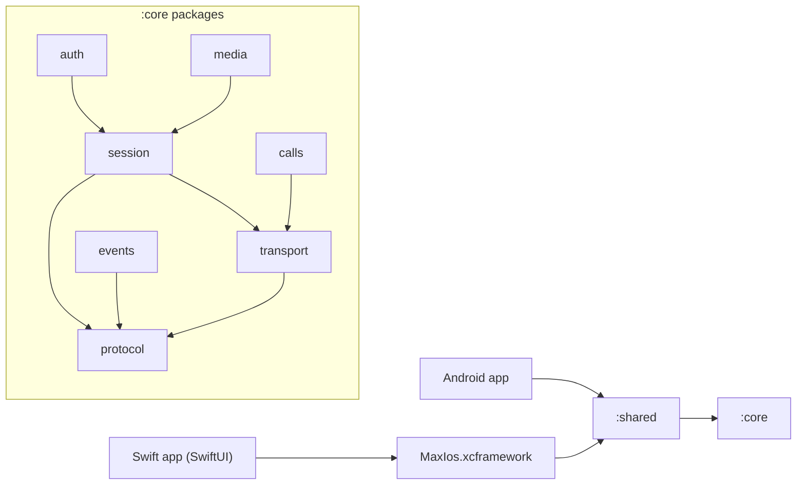

# Архитектура max-kmp-core (Kotlin Multiplatform)

> **Рекомендация / план, не факт.** Протокольные факты — в [protocol.md](protocol.md) (с цитатами на kolibri `a6cdce9` и PyMax `origin/dev/2.5.0`). Здесь — раскладка модулей и классов ядра. Эскиз сигнатур P0 — в [protocol.md §J](protocol.md#j-рекомендуемая-модульная-раскладка-max-kmp-core); здесь он не дублируется, а дополняется.
>
> **Стартовая платформа — iOS (Swift)**, затем Android. План iOS-клиента: [ios-plan.md](ios-plan.md).

## 1. Gradle-модули (существующие)

| Модуль | Роль | iOS-артефакт |
|--------|------|--------------|
| `:core` | протокол, транспорт, сессия, auth, media, calls | framework `MaxCore` (static), `core/build.gradle.kts` |
| `:shared` | публичный API (`com.max.shared.Session`), `api(project(":core"))` | framework `MaxShared` (static) |
| `:ios` | iOS-мост (`com.max.ios.IosBridge`), cinterop `maxc.def` (пока TODO) | framework `MaxIos` (static) |
| `:android` | Android-обёртки (`NativeBridge.kt`) | — |
| `:desktop` | JVM/Compose | — |

## 2. Направление зависимостей



Правило: пакеты нижнего уровня (`protocol`) ничего не знают о верхних; `session` не знает про `auth`/`media`; UI-платформы видят только `:shared` (и то, что `:ios` экспортирует).

## 3. Пакеты и классы (P0/P1/P2)

| Пакет | Класс / файл | P | Назначение (см. protocol.md) |
|-------|--------------|---|------------------------------|
| `com.max.core.protocol` | `Framing.kt`: `Framing`, `Packet`, `Cmd`, `PacketReceiver` | P0 | 10-байтный заголовок, reassembly (§B.1–B.2) |
| | `Compression.kt` (новый) | P0 | LZ4-block out ≥32 B, sniff Zstd/LZ4-frame/LZ4-block in (§B.4) |
| | `Opcodes.kt`: `Opcodes`, `name()` | P0 | union kolibri ∪ PyMax (§E) |
| | `MessagePack.kt`: `MessagePackCodec`, `MsgValue` | P0 | payload (§F.3) |
| `com.max.core.transport` | `TlsTransport.kt`: `TlsTransport`, `TransportConfig` | P0 | TLS TCP, timeouts 15/30 s (§B.6) |
| | `Dispatcher.kt` (новый) | P0 | seq→pending, `cmd 1/2/3` = ответ, `cmd 0` = push (§B.7) |
| | `ProxyConnector.kt` (новый) | P1 | HTTP CONNECT / SOCKS5 (§B.8) |
| | `TrustStore.kt` (новый, expect/actual) | P1 | opt-in Минцифры CA (§B.6, §K14) |
| `com.max.core.session` | `SessionMachine.kt`: `SessionMachine`, `SessionState` | P0 | handshake 6, состояния (§C.1–C.2) |
| | `HandshakeConfig.kt` / `UserAgent` (новый) | P0 | поля `userAgent` (§C.2) |
| | `PingScheduler.kt` (новый) | P0 | PING 1, 30 s, `interactive` (§C.3) |
| | `ReconnectPolicy.kt` (новый) | P0 | backoff 2/4/8/15 s (§C.4) |
| `com.max.core.events` | `EventBus.kt` (новый): `SharedFlow<Packet>` + типизированные `CoreEvent` | P0 | pushes 128 `NOTIF_MESSAGE`, 129, 130, 137… (§E) |
| `com.max.core.auth` | `AuthService.kt` (новый), `ChatCacheFingerprint` | P0 | AUTH_REQUEST→AUTH→LOGIN, пароль 115 (§C.5, §D.1–D.2) |
| | `QrAuth.kt` (новый) | P1 | 288/289/291 (§D.3) |
| | `TokenStore` (interface, actual: Keychain / EncryptedSharedPreferences) | P0 | хранение login token |
| `com.max.core.api` | `ChatsApi`, `MessagesApi` (новые) | P0 | `CHATS_LIST` 53, `CHAT_HISTORY` 49, `MSG_SEND` 64 |
| `com.max.core.media` | `MediaUploader.kt` (новый) | P1 (video parallel — P2) | §G |
| `com.max.core.calls` | `CallSignaling.kt`, `Vcp` (новые) | P2 | §H |
| `com.max.shared` | `Session.kt` (фасад), `MaxClient` (новый) | P0 | единая точка для Swift/Android |

## 4. Source sets

```text
core/src/
  commonMain/kotlin/com/max/core/{protocol,transport,session,events,auth,api,media,calls}
  iosMain/kotlin/com/max/core/     # actual: TLS (Ktor darwin / Network.framework), TrustStore, TokenStore (Keychain)
  androidMain/kotlin/com/max/core/ # actual: TLS (Ktor okhttp / sockets), TrustStore, TokenStore
  jvmMain/kotlin/com/max/core/     # desktop / тесты
shared/src/
  commonMain/kotlin/com/max/shared/  # Session, MaxClient, DTO для UI
  iosMain/ androidMain/ jvmMain/    # PlatformSession.kt (уже есть)
ios/src/
  iosMain/kotlin/com/max/ios/        # IosBridge: Swift-friendly обёртки (callbacks/Flow → Swift)
  nativeInterop/cinterop/maxc.def   # только если появится внешняя C-библиотека
```

Всё протокольное — в `commonMain`; в `iosMain`/`androidMain` — только `actual` для сокета/TLS, хранилища секретов и корней доверия.

## 5. Граница экспорта на iOS

- **Основной путь (P0):** Kotlin/Native `binaries.framework` → собрать **XCFramework** (`MaxIos` или объединённый `MaxShared`) и подключить в Xcode/SPM. Swift вызывает Objective-C-совместимый API, сгенерированный Kotlin/Native; `suspend` → completion/async, `Flow` → адаптер в `IosBridge` (callback/`AsyncStream` на стороне Swift).
- **cinterop + `maxc.def`:** направление обратное — даёт Kotlin доступ к **внешней C-библиотеке** (например, если бы транспорт/кодек был взят из Rust C ABI). `maxc.def` сейчас — заглушка (`headers`/`staticLibraries` закомментированы). Для чисто-Kotlin ядра не нужен; держать P2/опционально.
- Экспортировать только `com.max.shared` + `com.max.ios` (не весь `core`), чтобы API для Swift был узким и стабильным.

Подробно (включая Swift-обёртки) — [ios-plan.md §1–2](ios-plan.md).

## 6. Порядок работ

1. **P0 iOS:** protocol → transport(+Dispatcher) → session(+Ping/Reconnect) → auth(SMS, пароль) → api(chats/messages) → EventBus → shared/ios export → Swift-клиент ([ios-plan.md](ios-plan.md)).
2. **P0 Android:** те же `commonMain`, `androidMain` actual'ы, Android UI.
3. **P1:** proxy, Минцифры trust, QR, MediaUploader (photo/file), LOGIN2, push-регистрация (после эксперимента §K).
4. **P2:** video parallel upload, CallSignaling, stories (EXPERIMENTAL), desktop.

Открытые протокольные вопросы, влияющие на ядро (cmd=2, исходящее сжатие, поля handshake, 158) — [protocol.md §K](protocol.md#k-открытые-вопросы).

## 7. Конвенция пакетов

- Корневой пакет — **`com.max`**. Не `ru.max` и не голый `max`. Это по аналогии с `ru.kolibri` в `kolibri-kotlin`: у библиотеки один явный корень с доменным префиксом.
- Пакет модуля задаётся как `com.max.<модуль>[.<слой>]`: `com.max.core.protocol`, `com.max.core.transport`, `com.max.shared`, `com.max.android`, `com.max.ios`, `com.max.desktop`.
- Путь к исходникам повторяет пакет: `<модуль>/src/<sourceSet>/kotlin/com/max/<модуль>/…`.
- Gradle: `group = "com.max.kmp"`. `namespace` у Android-модулей совпадает с корнем модуля (`com.max.core`, `com.max.shared`, `com.max.android`). Пакет cinterop — `com.max.ios.cinterop`.
- Экспорт на iOS: в XCFramework попадают только `com.max.shared` и `com.max.ios` (см. §5).

## 8. Целевая архитектура (план, не текущее состояние)

> Это структура, к которой мы идём. Файлы с пометкой «план» пока не существуют и появляются по мере работ (§6). Текущий скелет — в §1 и §4.

### 8.1. Дерево репозитория

```text
max-kmp-core/
├── core/                                        # KMP-ядро: протокол, сеть, сессия
│   ├── build.gradle.kts
│   └── src/
│       ├── commonMain/kotlin/com/max/core/
│       │   ├── protocol/
│       │   │   ├── Framing.kt                   # 10-байтный заголовок, сборка пакетов   P0
│       │   │   ├── Opcodes.kt                   # таблица опкодов (kolibri ∪ PyMax)       P0
│       │   │   ├── MessagePack.kt               # MessagePackCodec, MsgValue              P0
│       │   │   └── Compression.kt               # LZ4-block / LZ4-frame / Zstd  (план)    P0
│       │   ├── transport/
│       │   │   ├── TlsTransport.kt              # TLS TCP к api2.oneme.ru                 P0
│       │   │   ├── Dispatcher.kt                # seq → ответ, push → EventBus  (план)    P0
│       │   │   └── ProxySupport.kt              # HTTP CONNECT / SOCKS5         (план)    P1
│       │   ├── session/
│       │   │   ├── SessionMachine.kt            # состояния соединения                    P0
│       │   │   ├── Handshake.kt                 # опкод 6, userAgent            (план)    P0
│       │   │   ├── Ping.kt                      # PING 1 каждые 30 с            (план)    P0
│       │   │   └── Reconnect.kt                 # backoff 2/4/8/15 с            (план)    P0
│       │   ├── auth/
│       │   │   ├── Auth.kt                      # AuthService: SMS 17→18→19, 2FA 115      P0
│       │   │   └── QrAuth.kt                    # 288/289/290/291               (план)    P1
│       │   ├── api/                             # ChatsApi, MessagesApi         (план)    P0
│       │   ├── events/                          # EventBus (SharedFlow)         (план)    P0
│       │   ├── media/
│       │   │   └── MediaUploader.kt             # фото/файлы P1, параллельное видео P2 (план)
│       │   ├── calls/
│       │   │   └── CallSignaling.kt             # vcp → ws2 → WebRTC            (план)    P2
│       │   ├── push/
│       │   │   └── PushToken.kt                 # регистрация токена, опкод неизвестен (план) P1
│       │   └── Platform.kt
│       ├── androidMain/kotlin/com/max/core/     # actual: сокет/TLS, TokenStore, TrustStore
│       ├── iosMain/kotlin/com/max/core/         # actual: Ktor Darwin / Network.framework, Keychain
│       └── jvmMain/kotlin/com/max/core/         # actual: JVM-сокеты, тесты
├── shared/                                      # узкий публичный API
│   ├── build.gradle.kts
│   └── src/
│       ├── commonMain/kotlin/com/max/shared/    # Session.kt, MaxClient (план), DTO
│       └── {androidMain,iosMain,jvmMain}/kotlin/com/max/shared/PlatformSession.kt
├── android/                                     # Android-обёртки и приложение
│   ├── build.gradle.kts
│   └── src/main/
│       ├── AndroidManifest.xml
│       ├── jniLibs/                             # только для нативных .so (WebRTC и т. п.)
│       └── kotlin/com/max/android/NativeBridge.kt
├── ios/                                         # iOS-мост → XCFramework для Swift
│   ├── build.gradle.kts
│   └── src/
│       ├── iosMain/kotlin/com/max/ios/IosBridge.kt
│       └── nativeInterop/cinterop/maxc.def      # пакет com.max.ios.cinterop, опционально
├── iosApp/                                      # (план) Xcode-проект на SwiftUI, см. ios-plan.md
├── desktop/                                     # Compose Multiplatform (JVM)             P2
│   ├── build.gradle.kts
│   └── src/jvmMain/kotlin/com/max/desktop/Main.kt
├── docs/
│   ├── protocol.md
│   ├── architecture.md
│   └── ios-plan.md
├── gradle/libs.versions.toml
├── build.gradle.kts · settings.gradle.kts · gradle.properties
└── README.md · LICENSE · .gitignore
```

### 8.2. Таргеты и направление вызовов

```text
 iOS                            Android                         Desktop
 SwiftUI-клиент (iosApp)        Kotlin-клиент (android)         Compose Multiplatform (desktop)
        │                              │                                │
        ▼                              ▼                                ▼
 XCFramework: com.max.ios       прямой вызов Kotlin             JVM
 (Obj-C/C-интерфейс)            (JNI — только для нативных .so)
        │                              │                                │
        └───────────────┬──────────────┴────────────────┬───────────────┘
                        ▼                               ▼
                   com.max.shared  (MaxClient, Session, DTO)
                        │
                        ▼
                   com.max.core:  auth · api · media · calls · push
                        │
                        ▼
                   session ──▶ transport ──▶ protocol
                                    │
                                    ▼
                         api2.oneme.ru  (TLS TCP, MessagePack)

 Входящие события идут обратно вверх: protocol → EventBus → Flow → (Swift: AsyncStream)
```

Порядок работ: сначала iOS, потом Android, потом Desktop (см. §6 и [ios-plan.md](ios-plan.md)).

### 8.3. Стек

| Слой | Технологии |
|------|------------|
| Ядро | Kotlin Multiplatform, Kotlin Coroutines, Ktor (сеть/TLS), Kotlin Serialization + MessagePack-библиотека (выбор открыт, TODO в `libs.versions.toml`), LZ4/Zstd |
| iOS | SwiftUI, async/await, `AsyncStream`, XCFramework из Kotlin/Native |
| Android | Kotlin, Jetpack Compose |
| Desktop | Compose Multiplatform (рендер через Skia) |
| Звонки | WebRTC (нативные SDK), сигналинг ws2 в `CallSignaling` |

### 8.4. Внешние референсы

| Репозиторий | Что сверяем | Лицензия |
|-------------|-------------|----------|
| [KometTeam/kolibri](https://github.com/KometTeam/kolibri) | wire-формат, фрейминг, сессия, reconnect, звонки (vcp/ws2), загрузка медиа | MIT / Apache-2.0 |
| [MaxApiTeam/PyMax](https://github.com/MaxApiTeam/PyMax) | payload-схемы, доменные модели, авторизация SMS/QR/2FA, опкоды | MIT |

Код из этих репозиториев напрямую не копируется. Мы изучаем поведение, а факты с ссылками на файлы и строки собраны в [protocol.md](protocol.md).
