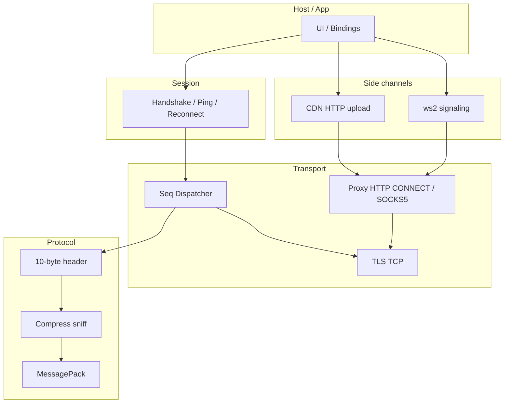

# Архитектура протокола Max (референс для max-kmp-core)

> **Статус:** справочный документ по поведению кода референсов. Код не копируется.
> Описывает наблюдаемые факты; раздел J — рекомендация, не факт.

## Источники

| Источник | Коммит / ветка | Лицензия |
|----------|----------------|----------|
| [KometTeam/kolibri](https://github.com/KometTeam/kolibri) (`kolibri-net`) | `a6cdce9` (`a6cdce9e0e75d33aa0c398988d3b45e25c8908ab`) | MIT OR Apache-2.0 |
| [MaxApiTeam/PyMax](https://github.com/MaxApiTeam/PyMax) | ветка `origin/dev/2.5.0`, HEAD `190e391152150a0971cae13a573218dc41f1b80b`; версия пакета `2.4.1` (`pyproject.toml`) | MIT |

Дата сборки документа: **2026-09-28**.

Префикс цитат: `kolibri:` — путь относительно корня репозитория kolibri; `PyMax:` — относительно корня PyMax. Если факт в коде не найден — «не найдено».

---

## A. Архитектура клиента

### A.1 kolibri (Rust, `kolibri-net`)

Слои (снизу вверх):

1. **Protocol** — `packet` / `codec` / `framing` / `compress` / `opcodes` / `json` (`kolibri:kolibri-net/src/protocol/`).
2. **Transport** — TLS TCP (`rustls` + `tokio`), seq-диспетчер, proxy, wiretap (`kolibri:kolibri-net/src/transport/`).
3. **Session** — handshake (opcode 6), ping, reconnect+backoff (`kolibri:kolibri-net/src/session/`).
4. **Auth helper** — anti-spoof fingerprint (`kolibri:kolibri-net/src/auth.rs`).
5. **Media** — HTTP(S) CDN upload (`kolibri:kolibri-net/src/media/`).
6. **Calls** — decode `vcp`, ws2 signaling (`kolibri:kolibri-net/src/calls/`).

Доменных моделей чатов/сообщений в kolibri **нет**: payload остаётся MessagePack/`rmpv::Value`; JSON-мост — опциональный (`kolibri:kolibri-net/src/protocol/json.rs`).

### A.2 PyMax (Python)

Слои:

1. **Transport** — TCP / WebSocket (`PyMax:src/pymax/transport/`).
2. **Protocol** — TCP framing + msgpack (+ опц. WS JSON) (`PyMax:src/pymax/protocol/`).
3. **Connection** — seq pending, recv loop (`PyMax:src/pymax/connection/`).
4. **Dispatch** — маршрутизация push → handlers (`PyMax:src/pymax/dispatch/`).
5. **API services** — `auth`, `session`, `messages`, `chats`, `uploads`, `users`, `self`, `bots` (`PyMax:src/pymax/api/`).
6. **Domain types** — Pydantic `Message`, `Chat`, `User`, attachments… (`PyMax:src/pymax/types/domain/`).
7. **Session store** — персистентная сессия/токен (`PyMax:src/pymax/session/`).
8. **Fingerprint / versions** — APK digests каталог (`PyMax:src/pymax/fingerprint/`, `PyMax:src/pymax/versions/`).
9. **Auth flows** — SMS / QR / providers (`PyMax:src/pymax/auth/`).
10. **Telemetry** — навигация (`PyMax:src/pymax/telemetry/`).

### A.3 Контраст

| Аспект | kolibri | PyMax |
|--------|---------|-------|
| Язык / runtime | Rust async (`tokio`) | Python asyncio |
| Домен | нет | полный Pydantic |
| Сжатие исходящее | LZ4-**block**, порог 32 B | **закомментировано** (flags=0) |
| Звонки | `vcp` + ws2 | opcode `NOTIF_CALL_START` есть; ws2/vcp — **не найдено** |
| Медиа HTTP | свой TLS HTTP client | `aiohttp` |
| Proxy | HTTP CONNECT / SOCKS5 в ядре | через конфиг/`aiohttp` proxy |
| Минцифры CA | флаг + PEM | **не найдено** |



---

## B. Протокол на проводе

### B.1 Заголовок (kolibri)

10 байт big-endian (`kolibri:kolibri-net/src/protocol/packet.rs:1-13`, `kolibri:kolibri-net/src/protocol/codec.rs:37-44`):

| Offset | Поле | Тип |
|--------|------|-----|
| `[0]` | `ver` | `u8`, константа `PROTOCOL_VERSION = 10` |
| `[1]` | `cmd` | `u8` |
| `[2..4]` | `seq` | `u16` BE |
| `[4..6]` | `opcode` | `u16` BE |
| `[6..10]` | `packedLen` | high byte = compression flag, low 24 bits = длина тела |
| `[10..]` | payload | MessagePack, опционально сжатый |

### B.2 Значения `cmd` (kolibri)

(`kolibri:kolibri-net/src/protocol/packet.rs:16-22`):

| Значение | Константа | Смысл в kolibri |
|----------|-----------|-----------------|
| `0` | `REQUEST` / `PUSH` | исходящий request и входящий push (направление различает) |
| `1` | `OK` | успешный ответ |
| `2` | `NOT_FOUND` | ответ «не найдено» (матчится к pending по `seq`) |
| `3` | `ERROR` | ошибка |

Диспетчер считает ответами `OK | ERROR | NOT_FOUND` (`kolibri:kolibri-net/src/transport/dispatcher.rs:41-54`).

### B.3 PyMax `Command` — расхождение имён

(`PyMax:src/pymax/protocol/enums.py:4-10`):

| Значение | PyMax | kolibri |
|----------|-------|---------|
| `0` | `REQUEST` | `REQUEST`/`PUSH` |
| `1` | `RESPONSE` | `OK` |
| `2` | **`EVENT`** | **`NOT_FOUND`** |
| `3` | `ERROR` | `ERROR` |

В PyMax pending резолвится только при `cmd in (RESPONSE, ERROR)` (`PyMax:src/pymax/connection/connection.py:213-216`). Push/event-маппер требует `cmd == REQUEST` (`PyMax:src/pymax/dispatch/mapping.py:52`). Значение `2` в PyMax **не** обрабатывается как ответ на request. Код серверного `NOT_FOUND` в live-трафике в репозиториях **не найден** как отдельный тест-вектор.

### B.4 Сжатие — факт vs README

**Исходящее (kolibri, код):** если `payload.len() < COMPRESSION_THRESHOLD` (32) — без сжатия, flag=`0`; иначе `compress_lz4_block(payload)`, flag = `(raw_len / comp_len) + 1` (`kolibri:kolibri-net/src/protocol/codec.rs:5-34`, `kolibri:kolibri-net/src/protocol/compress.rs:51-55`).

**README kolibri утверждает:** «Outgoing compression is LZ4 frame» (`kolibri:kolibri-net/README.md:39-41`). **Расхождение:** код шлёт **LZ4 block**, не frame. Функция `compress_lz4_frame` есть, но помечена «Kept for interop tests; outgoing traffic uses the block form» (`kolibri:kolibri-net/src/protocol/compress.rs:57-63`).

**Входящее (kolibri):** при `comp_flag != 0` — `decompress` с sniff по magic (`kolibri:kolibri-net/src/protocol/compress.rs:22-35`):

| Magic | Формат |
|-------|--------|
| `28 B5 2F FD` | Zstd |
| `04 22 4D 18` | LZ4 frame |
| иначе | LZ4 block |

Лимиты: `MAX_DECOMPRESSED_SIZE = 32 MiB` (`kolibri:kolibri-net/src/protocol/compress.rs:4`); буфер фрейминга `MAX_BUFFER_SIZE = 16 MiB` (`kolibri:kolibri-net/src/protocol/framing.rs:5`).

**PyMax исходящее:** блок сжатия **закомментирован**, `flags = 0` всегда (`PyMax:src/pymax/protocol/tcp/protocol.py:34-38`).

**PyMax входящее:** по `flags`: `0` — без сжатия; `0 < flags ≤ 0x7F` — LZ4 block; `flags == 0xFF` — Zstd; `flags > 0x7F` (кроме `0xFF`) — ошибка (`PyMax:src/pymax/protocol/tcp/payload.py:118-141`). LZ4-frame sniff по magic — **не найдено** в PyMax.

### B.5 Framing PyMax TCP / WS

- TCP: `struct.Struct(">BBHHI")` — ver, cmd, seq, opcode, packed_len (`PyMax:src/pymax/protocol/tcp/framing.py:6-28`); `version = 10` (`PyMax:src/pymax/protocol/tcp/protocol.py:17`).
- WS: JSON encode/decode `OutboundFrame`/`InboundFrame`, `version = 11` (`PyMax:src/pymax/protocol/ws/protocol.py:12-27`). Отдельный бинарный 10-байтный header на WS — **не найдено**.

### B.6 TLS (kolibri)

- `rustls` + `ring`, корни `webpki_roots::TLS_SERVER_ROOTS` (`kolibri:kolibri-net/src/transport/tls.rs:28-42`).
- Опционально `set_trust_mincifry_ca(true)` добавляет 2 якоря из `mincifry_ca.pem` (Root + Sub) (`kolibri:kolibri-net/src/transport/tls.rs:12-26`, тест `:128-145`).
- Hosts в примерах: `api.oneme.ru:443` (основной), `api2.oneme.ru:443` (probe Минцифры) (`kolibri:kolibri-net/examples/auth_request.rs:16-17`, `kolibri:kolibri-net/examples/mincifry_probe.rs`).
- `insecure_tls` — AcceptAnyCert (`kolibri:kolibri-net/src/transport/tls.rs:74-87`).
- Таймауты по умолчанию: connect 15 s, request 30 s (`kolibri:kolibri-net/src/transport/client.rs:41-42`).

### B.7 Seq / dispatcher / pushes

- Seq: pre-increment wrapping `u16`, первый request — seq 1 (`kolibri:kolibri-net/src/transport/client.rs:169-172`).
- Pending map `seq → oneshot`; push (не OK/ERROR/NOT_FOUND) → broadcast capacity 256 (`kolibri:kolibri-net/src/transport/dispatcher.rs`, `client.rs:20`).
- PyMax: `_seq` стартует с `-1`, `next_seq` = `(seq+1)%0x10000` (`PyMax:src/pymax/connection/connection.py:36`, `:240-242`).

### B.8 Proxy (kolibri)

`ProxyConfig::parse("scheme://[user:pass@]host:port")`, schemes `http` / `socks5` / `socks5h` (`kolibri:kolibri-net/src/transport/proxy.rs:32-68`). HTTP CONNECT ждёт status 200; SOCKS5 — greeting + optional user/pass + CONNECT domain (`:108-234`). Применяется к socket, media, ws2.

---

## C. Сессия (kolibri) и сравнение с PyMax

### C.1 Состояния

`Disconnected → Connecting → Connected → Online` (`kolibri:kolibri-net/src/session/manager.rs:17-23`). После успешного handshake — `Online`; при обрыве — reconnect если `auto_reconnect` (`:180-237`).

### C.2 Handshake opcode 6

Payload строится в `build_handshake_payload` (`kolibri:kolibri-net/src/session/manager.rs:311-370`):

**Корневые ключи:**

| Ключ | Условие |
|------|---------|
| `mt_instanceid` | если `instance_id` не пуст |
| `userAgent` | всегда (map) |
| `clientSessionId` | если `!= 0` |
| `deviceId` | всегда |

**Ключи `userAgent`** (из `UserAgent` в `kolibri:kolibri-net/src/session/config.rs:8-24` + builder):

| Ключ | Условие |
|------|---------|
| `deviceType`, `appVersion`, `osVersion`, `timezone`, `screen`, `pushDeviceType`, `locale`, `deviceName`, `deviceLocale` | всегда |
| `headerUserAgent` | если `Some` |
| `isPwa` | если `Some` |
| `arch` | если не пустая строка |
| `buildNumber` | если `!= 0` |

**Ответ `HandshakeInfo`:** извлекаются `callsSeed`, `device_name`; весь map в `payload` (`kolibri:kolibri-net/src/session/manager.rs:27-42`).

**PyMax mobile:** `MobileHandshakePayload` — `mt_instanceid`, `userAgent`, `clientSessionId` (default `randint(1,70)`), `deviceId` (`PyMax:src/pymax/api/session/payloads.py:61-65`). Web: только `userAgent` + `deviceId`, без `mt_instanceid` / `clientSessionId` (`:68-75`). `isPwa` в PyMax payload — **не найдено**. Ответ: `HandshakeResponse.calls_seed`, `app-update-type` (`PyMax:src/pymax/types/domain/handshake.py:6-16`).

### C.3 Ping

- Opcode `PING = 1`, payload `{"interactive": bool}` (`kolibri:kolibri-net/src/session/manager.rs:373-376`).
- Интервал по умолчанию **30 s**, `ping_interactive = true` (`kolibri:kolibri-net/src/session/config.rs:64-65`).
- Первый ping — через один интервал после connect (`manager.rs:266-267`).

Периодический ping в PyMax как отдельный session-loop — **не найдено** (есть поле `interactive` в login/sync payloads).

### C.4 Reconnect backoff (kolibri)

Формула `(2 * 2^min(attempt,3)).clamp(2, 15)` → **2, 4, 8, 15, 15, …** секунд (`kolibri:kolibri-net/src/session/manager.rs:304-308`, тест `:405-412`).

PyMax: `ExtraConfig.reconnect: bool = True`, `reconnect_delay: float = 1.0` (фиксированная пауза, не экспонента) (`PyMax:src/pymax/config.py:253-254`).

### C.5 Auth fingerprint

96 байт = три SHA-256 подряд (signature, dex, so):

`SHA256(digest || int64_be(calls_seed) || utf8(device_id))`

(`kolibri:kolibri-net/src/auth.rs:9-33`). В примерах hex digests APK существуют в `examples/auth_request.rs` (значения **не копируются** в этот документ).

PyMax: тот же алгоритм в `FingerprintGenerator.generate_fingerprint` (`PyMax:src/pymax/fingerprint/fingerprint.py:11-30`); digests из `VersionCatalog` / `apk_fingerprints.json` (`PyMax:src/pymax/versions/catalog.py`). Используется как `mode` в `AUTH_REQUEST` и `chatCacheFingerprint` в `LOGIN` (`PyMax:src/pymax/api/auth/service.py:86-95`, `:180-193`).

---

## D. Авторизация

### D.1 SMS: request → verify → login

**kolibri (examples):**

1. `AUTH_REQUEST` (17): map `phone`, `type=START_AUTH`, `language=ru`, `mode=<96-byte fingerprint>` (`kolibri:kolibri-net/examples/auth_request.rs:81-91`).
2. Ответ: `token` (temp) (`:97`).
3. `AUTH` (18): `token`, `verifyCode`, `authTokenType=CHECK_CODE` (`:113-119`, также `auth_verify.rs:46-54`).
4. Полноценный `LOGIN` (19) в examples — **не найдено** (пример останавливается на verify).

**PyMax:**

1. `RequestCodePayload`: `phone`, `type=START_AUTH`, `mode` (bytes|None; None для WEB) (`PyMax:src/pymax/api/auth/payloads.py:10-13`) → opcode `AUTH_REQUEST`.
2. `SendCodePayload`: `token`, `verifyCode`, `authTokenType=CHECK_CODE` (`:16-20`) → `AUTH`.
3. `SmsAuthFlow`: при `login_token` → сохранить; при `password_challenge` → 2FA; при `register_token` → `confirm_registration` (`PyMax:src/pymax/auth/sms.py:73-110`).
4. `mobile_login`: `SyncPayload` с `userAgent`, `token`, `chatCacheFingerprint`, sync markers, `interactive`, `exp`, `configHash` → opcode `LOGIN` (`PyMax:src/pymax/api/auth/payloads.py:57-68`, `service.py:150-193`).
5. Опционально `LOGIN2` (opcode 8 в PyMax) — `Login2Payload` (`service.py:204-218`).

### D.2 2FA / password

PyMax: `check_password(track_id, password)` → `AUTH_LOGIN_CHECK_PASSWORD` (115) (`PyMax:src/pymax/api/auth/service.py:120-135`). Управление 2FA: track (`AUTH_CREATE_TRACK` 112), set password/hint/email, `AUTH_SET_2FA` и др. (`payloads.py:100-136`). В kolibri opcodes 2FA объявлены (`opcodes.rs:24-35`), готовых payload-builders — **не найдено** (только const).

### D.3 QR (PyMax)

- `GET_QR` (288) → `request_qr` (`service.py:253-254`).
- Poll `GET_QR_STATUS` (289) с `trackId` (`:259-261`).
- `LOGIN_BY_QR` (291) confirm (`:266-268`).
- Approve с телефона: `AUTH_QR_APPROVE` (290) + `ApproveQrLoginPayload(qr_link)` (`service.py:424-426`).
- Flow в `PyMax:src/pymax/auth/qr.py`; WebClient — `PyMax:src/pymax/client_web.py`.

В kolibri есть `AUTH_QR_APPROVE = 290`; opcodes 288/289/291 — **не найдены**.

### D.4 Anti-spoof / fingerprint (PyMax)

`VersionCatalog.RECOMMENDED_APP_VERSION = "26.25.0"`, remote `https://hashes.pymax.org/versions.json` (`PyMax:src/pymax/versions/catalog.py:24-25`). Модель `ApkBuildFingerprint`: certificate/dex/so meta SHA-256, `build_number` (`PyMax:src/pymax/fingerprint/models.py`).

---

## E. Опкоды

Источники: `kolibri:kolibri-net/src/protocol/opcodes.rs` (168 const); `PyMax:src/pymax/protocol/enums.py` `Opcode` (179 значений). Объединено: 180 кодов.


### Session / служебные

| code | kolibri | PyMax | note |
|------|---------|-------|------|
| 1 | `PING` | `PING` |  |
| 2 | `DEBUG` | `DEBUG` |  |
| 3 | `RECONNECT` | `RECONNECT` |  |
| 5 | `LOG` | `LOG` |  |
| 6 | `SESSION_INIT` | `SESSION_INIT` |  |
| 8 | `CONTACTS_GET` | `LOGIN2` | разные имена: kolibri `CONTACTS_GET` / PyMax `LOGIN2` |

### Profile / auth

| code | kolibri | PyMax | note |
|------|---------|-------|------|
| 16 | `PROFILE` | `PROFILE` |  |
| 17 | `AUTH_REQUEST` | `AUTH_REQUEST` |  |
| 18 | `AUTH` | `AUTH` |  |
| 19 | `LOGIN` | `LOGIN` |  |
| 20 | `LOGOUT` | `LOGOUT` |  |
| 21 | `SYNC` | `SYNC` |  |
| 22 | `CONFIG` | `CONFIG` |  |
| 23 | `AUTH_CONFIRM` | `AUTH_CONFIRM` |  |

### Auth 2FA

| code | kolibri | PyMax | note |
|------|---------|-------|------|
| 101 | `AUTH_LOGIN_RESTORE_PASSWORD` | `AUTH_LOGIN_RESTORE_PASSWORD` |  |
| 104 | `AUTH_2FA_DETAILS` | `AUTH_2FA_DETAILS` |  |
| 105 | `EXTERNAL_CALLBACK` | `EXTERNAL_CALLBACK` |  |
| 107 | `AUTH_VALIDATE_PASSWORD` | `AUTH_VALIDATE_PASSWORD` |  |
| 108 | `AUTH_VALIDATE_HINT` | `AUTH_VALIDATE_HINT` |  |
| 109 | `AUTH_VERIFY_EMAIL` | `AUTH_VERIFY_EMAIL` |  |
| 110 | `AUTH_CHECK_EMAIL` | `AUTH_CHECK_EMAIL` |  |
| 111 | `AUTH_SET_2FA` | `AUTH_SET_2FA` |  |
| 112 | `AUTH_CREATE_TRACK` | `AUTH_CREATE_TRACK` |  |
| 113 | `AUTH_CHECK_PASSWORD` | `AUTH_CHECK_PASSWORD` |  |
| 115 | `AUTH_LOGIN_CHECK_PASSWORD` | `AUTH_LOGIN_CHECK_PASSWORD` |  |
| 116 | `AUTH_LOGIN_PROFILE_DELETE` | `AUTH_LOGIN_PROFILE_DELETE` |  |

### Assets

| code | kolibri | PyMax | note |
|------|---------|-------|------|
| 25 | `PRESET_AVATARS` | `PRESET_AVATARS` |  |
| 26 | `ASSETS_GET` | `ASSETS_GET` |  |
| 27 | `ASSETS_UPDATE` | `ASSETS_UPDATE` |  |
| 28 | `ASSETS_GET_BY_IDS` | `ASSETS_GET_BY_IDS` |  |
| 29 | `ASSETS_ADD` | `ASSETS_ADD` |  |
| 259 | `ASSETS_REMOVE` | `ASSETS_REMOVE` |  |
| 260 | `ASSETS_MOVE` | `ASSETS_MOVE` |  |
| 261 | `ASSETS_LIST_MODIFY` | `ASSETS_LIST_MODIFY` |  |

### Contacts

| code | kolibri | PyMax | note |
|------|---------|-------|------|
| 31 | `—` | `SEARCH_FEEDBACK` | только PyMax |
| 32 | `CONTACT_INFO` | `CONTACT_INFO` |  |
| 33 | `CONTACT_ADD` | `CONTACT_ADD` |  |
| 34 | `CONTACT_UPDATE` | `CONTACT_UPDATE` |  |
| 35 | `CONTACT_PRESENCE` | `CONTACT_PRESENCE` |  |
| 36 | `CONTACT_LIST` | `CONTACT_LIST` |  |
| 37 | `CONTACT_SEARCH` | `CONTACT_SEARCH` |  |
| 38 | `CONTACT_MUTUAL` | `CONTACT_MUTUAL` |  |
| 39 | `CONTACT_PHOTOS` | `CONTACT_PHOTOS` |  |
| 40 | `CONTACT_SORT` | `CONTACT_SORT` |  |
| 42 | `CONTACT_VERIFY` | `CONTACT_VERIFY` |  |
| 43 | `REMOVE_CONTACT_PHOTO` | `REMOVE_CONTACT_PHOTO` |  |
| 46 | `CONTACT_INFO_BY_PHONE` | `CONTACT_INFO_BY_PHONE` |  |

### Chats

| code | kolibri | PyMax | note |
|------|---------|-------|------|
| 48 | `CHAT_INFO` | `CHAT_INFO` |  |
| 49 | `CHAT_HISTORY` | `CHAT_HISTORY` |  |
| 50 | `CHAT_MARK` | `CHAT_MARK` |  |
| 51 | `CHAT_MEDIA` | `CHAT_MEDIA` |  |
| 52 | `CHAT_DELETE` | `CHAT_DELETE` |  |
| 53 | `CHATS_LIST` | `CHATS_LIST` |  |
| 54 | `CHAT_CLEAR` | `CHAT_CLEAR` |  |
| 55 | `CHAT_UPDATE` | `CHAT_UPDATE` |  |
| 56 | `CHAT_CHECK_LINK` | `CHAT_CHECK_LINK` |  |
| 57 | `CHAT_JOIN` | `CHAT_JOIN` |  |
| 58 | `CHAT_LEAVE` | `CHAT_LEAVE` |  |
| 59 | `CHAT_MEMBERS` | `CHAT_MEMBERS` |  |
| 60 | `PUBLIC_SEARCH` | `PUBLIC_SEARCH` |  |
| 61 | `CHAT_PERSONAL_CONFIG` | `CHAT_PERSONAL_CONFIG` |  |
| 62 | `—` | `CHAT_LIVESTREAM_INFO` | только PyMax |
| 63 | `CHAT_CREATE` | `CHAT_CREATE` |  |

### Messages

| code | kolibri | PyMax | note |
|------|---------|-------|------|
| 64 | `MSG_SEND` | `MSG_SEND` |  |
| 65 | `MSG_TYPING` | `MSG_TYPING` |  |
| 66 | `MSG_DELETE` | `MSG_DELETE` |  |
| 67 | `MSG_EDIT` | `MSG_EDIT` |  |
| 68 | `CHAT_SEARCH` | `CHAT_SEARCH` |  |
| 70 | `MSG_SHARE_PREVIEW` | `MSG_SHARE_PREVIEW` |  |
| 71 | `MSG_GET` | `MSG_GET` |  |
| 72 | `MSG_SEARCH_TOUCH` | `MSG_SEARCH_TOUCH` |  |
| 73 | `MSG_SEARCH` | `MSG_SEARCH` |  |
| 74 | `MSG_GET_STAT` | `MSG_GET_STAT` |  |
| 75 | `CHAT_SUBSCRIBE` | `CHAT_SUBSCRIBE` |  |
| 91 | `—` | `MSG_GET_COMMENTS_INFO` | только PyMax |
| 92 | `MSG_DELETE_RANGE` | `MSG_DELETE_RANGE` |  |
| 94 | `—` | `MSG_DELETE_USER_COMMENTS` | только PyMax |

### Reactions

| code | kolibri | PyMax | note |
|------|---------|-------|------|
| 178 | `MSG_REACTION` | `MSG_REACTION` |  |
| 179 | `MSG_CANCEL_REACTION` | `MSG_CANCEL_REACTION` |  |
| 180 | `MSG_GET_REACTIONS` | `MSG_GET_REACTIONS` |  |
| 181 | `MSG_GET_DETAILED_REACTIONS` | `MSG_GET_DETAILED_REACTIONS` |  |
| 257 | `CHAT_REACTIONS_SETTINGS_SET` | `CHAT_REACTIONS_SETTINGS_SET` |  |
| 258 | `REACTIONS_SETTINGS_GET_BY_CHAT_ID` | `REACTIONS_SETTINGS_GET_BY_CHAT_ID` |  |

### Calls / Video chat

| code | kolibri | PyMax | note |
|------|---------|-------|------|
| 76 | `VIDEO_CHAT_START` | `VIDEO_CHAT_START` |  |
| 77 | `CHAT_MEMBERS_UPDATE` | `CHAT_MEMBERS_UPDATE` |  |
| 78 | `VIDEO_CHAT_START_ACTIVE` | `VIDEO_CHAT_START_ACTIVE` |  |
| 79 | `VIDEO_CHAT_HISTORY` | `VIDEO_CHAT_HISTORY` |  |
| 84 | `VIDEO_CHAT_CREATE_JOIN_LINK` | `VIDEO_CHAT_CREATE_JOIN_LINK` |  |
| 103 | `GET_INBOUND_CALLS` | `GET_INBOUND_CALLS` |  |
| 164 | `VIDEO_CHAT_DELETE_HISTORY` | `—` | только kolibri |
| 166 | `VIDEO_CHAT_JOIN_BY_LINK` | `VIDEO_CHAT_JOIN` | разные имена: kolibri `VIDEO_CHAT_JOIN_BY_LINK` / PyMax `VIDEO_CHAT_JOIN` |
| 195 | `VIDEO_CHAT_MEMBERS` | `VIDEO_CHAT_MEMBERS` |  |

### Media / Files

| code | kolibri | PyMax | note |
|------|---------|-------|------|
| 80 | `PHOTO_UPLOAD` | `PHOTO_UPLOAD` |  |
| 81 | `STICKER_UPLOAD` | `STICKER_UPLOAD` |  |
| 82 | `VIDEO_UPLOAD` | `VIDEO_UPLOAD` |  |
| 83 | `VIDEO_PLAY` | `VIDEO_PLAY` |  |
| 86 | `CHAT_PIN_SET_VISIBILITY` | `CHAT_PIN_SET_VISIBILITY` |  |
| 87 | `FILE_UPLOAD` | `FILE_UPLOAD` |  |
| 88 | `FILE_DOWNLOAD` | `FILE_DOWNLOAD` |  |
| 89 | `LINK_INFO` | `LINK_INFO` |  |
| 301 | `AUDIO_PLAY` | `AUDIO_PLAY` |  |

### Sessions / phone bind

| code | kolibri | PyMax | note |
|------|---------|-------|------|
| 96 | `SESSIONS_INFO` | `SESSIONS_INFO` |  |
| 97 | `SESSIONS_CLOSE` | `SESSIONS_CLOSE` |  |
| 98 | `PHONE_BIND_REQUEST` | `PHONE_BIND_REQUEST` |  |
| 99 | `PHONE_BIND_CONFIRM` | `PHONE_BIND_CONFIRM` |  |

### Bots / callbacks

| code | kolibri | PyMax | note |
|------|---------|-------|------|
| 117 | `CHAT_COMPLAIN` | `CHAT_COMPLAIN` |  |
| 118 | `MSG_SEND_CALLBACK` | `MSG_SEND_CALLBACK` |  |
| 119 | `SUSPEND_BOT` | `SUSPEND_BOT` |  |
| 144 | `CHAT_BOT_COMMANDS` | `CHAT_BOT_COMMANDS` |  |
| 145 | `BOT_INFO` | `BOT_INFO` |  |

### Location / mentions

| code | kolibri | PyMax | note |
|------|---------|-------|------|
| 124 | `LOCATION_STOP` | `LOCATION_STOP` |  |
| 125 | `—` | `LOCATION_SEND` | только PyMax |
| 126 | `—` | `LOCATION_REQUEST` | только PyMax |
| 127 | `GET_LAST_MENTIONS` | `GET_LAST_MENTIONS` |  |

### Stickers create

| code | kolibri | PyMax | note |
|------|---------|-------|------|
| 193 | `STICKER_CREATE` | `STICKER_CREATE` |  |
| 194 | `STICKER_SUGGEST` | `STICKER_SUGGEST` |  |

### Notifications (push)

| code | kolibri | PyMax | note |
|------|---------|-------|------|
| 128 | `NOTIF_MESSAGE` | `NOTIF_MESSAGE` |  |
| 129 | `NOTIF_TYPING` | `NOTIF_TYPING` |  |
| 130 | `NOTIF_MARK` | `NOTIF_MARK` |  |
| 131 | `NOTIF_CONTACT` | `NOTIF_CONTACT` |  |
| 132 | `NOTIF_PRESENCE` | `NOTIF_PRESENCE` |  |
| 134 | `NOTIF_CONFIG` | `NOTIF_CONFIG` |  |
| 135 | `NOTIF_CHAT` | `NOTIF_CHAT` |  |
| 136 | `NOTIF_ATTACH` | `NOTIF_ATTACH` |  |
| 137 | `NOTIF_CALL_START` | `NOTIF_CALL_START` |  |
| 139 | `NOTIF_CONTACT_SORT` | `NOTIF_CONTACT_SORT` |  |
| 140 | `NOTIF_MSG_DELETE_RANGE` | `NOTIF_MSG_DELETE_RANGE` |  |
| 142 | `NOTIF_MSG_DELETE` | `NOTIF_MSG_DELETE` |  |
| 143 | `NOTIF_CALLBACK_ANSWER` | `NOTIF_CALLBACK_ANSWER` |  |
| 147 | `NOTIF_LOCATION` | `NOTIF_LOCATION` |  |
| 148 | `NOTIF_LOCATION_REQUEST` | `NOTIF_LOCATION_REQUEST` |  |
| 150 | `NOTIF_ASSETS_UPDATE` | `NOTIF_ASSETS_UPDATE` |  |
| 152 | `NOTIF_DRAFT` | `NOTIF_DRAFT` |  |
| 153 | `NOTIF_DRAFT_DISCARD` | `NOTIF_DRAFT_DISCARD` |  |
| 154 | `NOTIF_MSG_DELAYED` | `NOTIF_MSG_DELAYED` |  |
| 155 | `NOTIF_MSG_REACTIONS_CHANGED` | `NOTIF_MSG_REACTIONS_CHANGED` |  |
| 156 | `NOTIF_MSG_YOU_REACTED` | `NOTIF_MSG_YOU_REACTED` |  |
| 159 | `NOTIF_PROFILE` | `NOTIF_PROFILE` |  |
| 277 | `NOTIF_FOLDERS` | `NOTIF_FOLDERS` |  |
| 292 | `NOTIF_BANNERS` | `NOTIF_BANNERS` |  |

### Transcription

| code | kolibri | PyMax | note |
|------|---------|-------|------|
| 202 | `AUDIO_TRANSCRIPTION` | `TRANSCRIBE_MEDIA` | разные имена: kolibri `AUDIO_TRANSCRIPTION` / PyMax `TRANSCRIBE_MEDIA` |
| 293 | `TRANSCRIPTION_RESULT` | `NOTIF_TRANSCRIPTION` | разные имена: kolibri `TRANSCRIPTION_RESULT` / PyMax `NOTIF_TRANSCRIPTION` |

### Misc

| code | kolibri | PyMax | note |
|------|---------|-------|------|
| 158 | `OK_TOKEN` | `CALLS_TOKEN` | разные имена: kolibri `OK_TOKEN` / PyMax `CALLS_TOKEN` |
| 160 | `WEB_APP_INIT_DATA` | `WEB_APP_INIT_DATA` |  |
| 161 | `COMPLAIN` | `COMPLAIN` |  |
| 162 | `COMPLAIN_REASONS_GET` | `COMPLAIN_REASONS_GET` |  |
| 176 | `DRAFT_SAVE` | `DRAFT_SAVE` |  |
| 177 | `DRAFT_DISCARD` | `DRAFT_DISCARD` |  |
| 196 | `CHAT_HIDE` | `CHAT_HIDE` |  |
| 198 | `CHAT_SEARCH_COMMON_PARTICIPANTS` | `CHAT_SEARCH_COMMON_PARTICIPANTS` |  |
| 199 | `PROFILE_DELETE` | `PROFILE_DELETE` |  |
| 200 | `PROFILE_DELETE_TIME` | `PROFILE_DELETE_TIME` |  |
| 256 | `—` | `ORG_INFO` | только PyMax |
| 290 | `AUTH_QR_APPROVE` | `AUTH_QR_APPROVE` |  |
| 300 | `CHAT_SUGGEST` | `CHAT_SUGGEST` |  |
| 302 | `—` | `BANNERS_GET` | только PyMax |
| 303 | `—` | `MSG_DELIVERY` | только PyMax |

### QR auth

| code | kolibri | PyMax | note |
|------|---------|-------|------|
| 288 | `—` | `GET_QR` | только PyMax |
| 289 | `—` | `GET_QR_STATUS` | только PyMax |
| 291 | `—` | `LOGIN_BY_QR` | только PyMax |

### Polls

| code | kolibri | PyMax | note |
|------|---------|-------|------|
| 304 | `SEND_VOTE` | `SEND_VOTE` |  |
| 305 | `VOTERS_LIST_BY_ANSWER` | `VOTERS_LIST_BY_ANSWER` |  |
| 306 | `GET_POLL_UPDATES` | `GET_POLL_UPDATES` |  |

### Folders

| code | kolibri | PyMax | note |
|------|---------|-------|------|
| 272 | `FOLDERS_GET` | `FOLDERS_GET` |  |
| 273 | `FOLDERS_GET_BY_ID` | `FOLDERS_GET_BY_ID` |  |
| 274 | `FOLDERS_UPDATE` | `FOLDERS_UPDATE` |  |
| 275 | `FOLDERS_REORDER` | `FOLDERS_REORDER` |  |
| 276 | `FOLDERS_DELETE` | `FOLDERS_DELETE` |  |

### Stories

| code | kolibri | PyMax | note |
|------|---------|-------|------|
| 208 | `STORIES_LIST` | `STORIES_LIST` |  |
| 209 | `STORIES_LIST_BY_OWNER` | `STORIES_LIST_BY_OWNER_ID` | разные имена: kolibri `STORIES_LIST_BY_OWNER` / PyMax `STORIES_LIST_BY_OWNER_ID` |
| 210 | `STORIES_GET_BY_OWNER` | `STORIES_GET_BY_OWNER_ID` | разные имена: kolibri `STORIES_GET_BY_OWNER` / PyMax `STORIES_GET_BY_OWNER_ID` |
| 211 | `STORIES_GET_STATS` | `STORIES_GET_STATS` |  |
| 212 | `STORIES_GET_DETAILED_STATS` | `STORIES_GET_DETAILED_STATS` |  |
| 213 | `STORIES_REACT` | `STORIES_REACT` |  |
| 214 | `STORIES_MARK` | `STORIES_MARK` |  |
| 215 | `STORIES_SEND` | `STORIES_SEND` |  |
| 216 | `NOTIF_STORIES_UPDATE` | `NOTIF_STORIES_UPDATE` |  |
| 217 | `STORIES_EDIT` | `STORIES_EDIT` |  |
| 218 | `STORIES_DELETE` | `STORIES_DELETE` |  |
| 220 | `STORIES_GET_BY_STORY_ID` | `STORIES_GET_BY_STORY_ID` |  |

### E.1 Только в одном источнике

**Только kolibri:** `164` `VIDEO_CHAT_DELETE_HISTORY`

**Только PyMax:** `31` `SEARCH_FEEDBACK`, `62` `CHAT_LIVESTREAM_INFO`, `91` `MSG_GET_COMMENTS_INFO`, `94` `MSG_DELETE_USER_COMMENTS`, `125` `LOCATION_SEND`, `126` `LOCATION_REQUEST`, `256` `ORG_INFO`, `288` `GET_QR`, `289` `GET_QR_STATUS`, `291` `LOGIN_BY_QR`, `302` `BANNERS_GET`, `303` `MSG_DELIVERY`

### E.2 Один код — разные имена

| code | kolibri | PyMax |
|------|---------|-------|
| 8 | `CONTACTS_GET` | `LOGIN2` |
| 158 | `OK_TOKEN` | `CALLS_TOKEN` |
| 166 | `VIDEO_CHAT_JOIN_BY_LINK` | `VIDEO_CHAT_JOIN` |
| 202 | `AUDIO_TRANSCRIPTION` | `TRANSCRIBE_MEDIA` |
| 209 | `STORIES_LIST_BY_OWNER` | `STORIES_LIST_BY_OWNER_ID` |
| 210 | `STORIES_GET_BY_OWNER` | `STORIES_GET_BY_OWNER_ID` |
| 293 | `TRANSCRIPTION_RESULT` | `NOTIF_TRANSCRIPTION` |

### E.3 Command vs cmd

См. §B.2–B.3: PyMax `Command.EVENT = 2` ≠ kolibri `cmd::NOT_FOUND = 2` по **семантике обработки** в клиенте.

---

## F. Payload-схемы (PyMax)

Базовый класс: `CamelModel` — `alias_generator=to_camel`, `populate_by_name=True`, `to_payload()` = `model_dump(by_alias=True, exclude_none=True)` (`PyMax:src/pymax/api/models.py:5-11`).

### F.1 Request models по сервисам (поля / defaults)

**session** (`PyMax:src/pymax/api/session/payloads.py`):

- `MobileUserAgentPayload`: `deviceType`, `appVersion`, `osVersion`, `timezone`, `screen`, `pushDeviceType?`, `arch?`, `locale`, `buildNumber?`, `deviceName`, `deviceLocale`, `release?`, `headerUserAgent?`
- `MobileHandshakePayload`: `mt_instanceid`, `userAgent`, `clientSessionId` (default rand 1..70), `deviceId`
- `WebHandshakePayload`: `userAgent`, `deviceId`

**auth** (`PyMax:src/pymax/api/auth/payloads.py`):

- `RequestCodePayload`: `phone`, `type=START_AUTH`, `mode`
- `SendCodePayload`: `token`, `verifyCode`, `authTokenType=CHECK_CODE`
- `CheckPasswordChallengePayload`: `trackId`, `password`
- `SyncPayload`: `userAgent`, `token`, `chatCacheFingerprint?`, `chatsCount?`, sync markers default `-1`, `interactive=True`, `exp`, `configHash`
- `WebSyncPayload`: `token`, `chatsCount=40`, `interactive=True`, sync markers `-1`
- `Login2Payload`: `needProfile`, `contactsSync`, `configHash`
- QR/2FA/registration: `CheckQrPayload`, `ConfirmQrPayload`, `CreateAuthTrackPayload(type=0)`, `SetPasswordPayload`, `RequestEmailCodePayload`, `SendEmailCodePayload`, `SetHintPayload`, `SetTwoFactorPayload`, `RemoveTwoFactorPayload`, `ApproveQrLoginPayload`, `ConfirmRegistrationPayload`

**messages** (`PyMax:src/pymax/api/messages/payloads.py`): `SendMessagePayload` (`chatId`, `message{text?,cid,elements,attaches,link?,delayedAttributes?}`, `notify=False`), `EditMessagePayload`, `DeleteMessagePayload`, `ChatHistoryPayload` (`backward=40`, …), reactions/read/vote/comments payloads — см. файл.

**chats / users / uploads / self / bots:** см. соответствующие `payloads.py` (CreateGroup, InviteUsers, FetchChats, FetchContacts, `UploadPayload(count=1,type=0,uploaderType=0,profile=False)`, folders, `RequestInitDataPayload`, `SendCallbackPayload`, …).

### F.2 Ключевые domain models

- **Message**: `id`, `chatId?`, `sender?`, `text=""`, `time`, `type`, `cid?`, `attaches[]`, `stats?`, `status?`, `reactionInfo?`, `options?`, `prevMessageId?`, `ttl?`, `unread?`, `mark?`, `elements[]`, `delayedAttributes?`, `link?` (`PyMax:src/pymax/types/domain/message.py:160-244`).
- **Chat**: `id`, `type`, `status`, `owner`, `participants`, `title?`, icon URLs, `lastMessage?`, timestamps, `newMessages`, `link?`, `access?`, `restrictions?`, `pinnedMessage?`, `participantsCount`, `description?`, `options?`, admins, … (`chat.py:17-99`).
- **User**: `id`, `accountStatus?`, `registrationTime?`, `country?`, avatar URLs, `names[]`, `options[]`, `photoId?`, `phone?`, `status?`, `description?`, `gender?`, `link?`, … (`user.py:22-77`).
- Attachments: Photo/Video/File/Audio/Sticker/Share/Contact/Call/Control/InlineKeyboard/Poll/Unknown — discriminator `_type` / `type` (`types/domain/attachments/`).
- Reactions: `ReactionInfo`, `ReactionCounter`; Poll: `Poll` / `PollAttachment`.

### F.3 Бинарные поля: kolibri JSON bridge vs PyMax msgpack

**kolibri** (`kolibri:kolibri-net/src/protocol/json.rs`):

- `{"$bin": "<base64>"}` ↔ MessagePack Binary
- `{"$ext": tag, "data": "<base64>"}` ↔ Ext
- ключ `"$int:<n>"` ↔ integer map key

**PyMax:** при decode msgpack `ext_hook` для **ext code 1** — рекурсивный unpack «wrapped value» (`PyMax:src/pymax/protocol/tcp/payload.py:14-52`). Integer map keys нормализуются в `str` (`:108-116`).

### F.4 `InboundFrame`

```text
InboundFrame(opcode: int, cmd: int = 0, seq: int | None = None,
             payload: dict | None = None, raw: dict | None = None)
```

(`PyMax:src/pymax/protocol/models.py:14-19`). Пример из docs:

```python
from pymax.protocol import InboundFrame

@client.on_raw()
async def raw(frame: InboundFrame, client: Client) -> None:
    print("opcode:", frame.opcode)
    print("payload:", frame.payload)
```

(`PyMax:docs/examples.rst:145-151`).

---

## G. Медиа

### G.1 kolibri

Control-plane URL через opcodes `PHOTO_UPLOAD` (80), `STICKER_UPLOAD` (81), `VIDEO_UPLOAD` (82), `FILE_UPLOAD` (87) — **получение URL в kolibri media-модуле не реализовано** (модуль принимает готовый `url`; комментарий: control plane на основном сокете) (`kolibri:kolibri-net/src/media/mod.rs:1-4`).

| Flow | HTTP | Особенности | Cite |
|------|------|-------------|------|
| `upload_file` | POST | `Content-Type: application/x-binary; charset=x-user-defined`, `Content-Disposition: attachment; filename=…`, `Content-Range: bytes 0-{n-1}/n`, UA percent-encoded; timeout 300 s | `upload.rs:18-58` |
| `upload_photo` | POST multipart | boundary `----KolibriBoundary{micros}`, field `file`; timeout 120 s | `:64-108` |
| `upload_video` | GET handshake → parallel POST chunks | `X-Uploading-Mode: parallel`, resume offset из body GET; `chunk_size`/`concurrency` параметры; Connection: close | `:114-216`, `ok_cdn_request` `:156-193` |
| `*_path` | streaming | чтение с диска чанками 64 KiB (`http.rs:173`) | `upload.rs` path variants |

User-Agent: `OKMessages/{appVersion} ({osVersion}; {deviceName}; {screen})` (`config.rs:31-35`), percent-encode как Dart `Uri.encodeComponent` (`upload.rs:219-239`).

### G.2 PyMax (`api/uploads`)

- Photo: `Opcode.PHOTO_UPLOAD` + `UploadPayload(profile=…)` → URL → `aiohttp` multipart `file` (`service.py:52-185`).
- Video/voice/video-note: `Opcode.VIDEO_UPLOAD` с разными `type`/`uploaderType`; video POST с `Content-Range`, chunk iter 1 MiB (`service.py:187+`, `:331+`).
- File: `Opcode.FILE_UPLOAD` (`:492+`).
- Параллельный resume-upload как в kolibri video — **не найдено** (одиночный POST / stream).

---

## H. Звонки

### H.1 kolibri `vcp`

Формат: `<rawLen>:<base64(LZ4-block(JSON))>` (`kolibri:kolibri-net/src/calls/vcp.rs:16-70`). JSON short keys: `tkn`, `wse`, `wsip`, `wte`, `vcae`, `srcp`, `et`, `stne`, `trne`, `trnu`, `trnp`, `iv`.

Opcodes bootstrap: push `NOTIF_CALL_START` (137); ответы 78/166 отдают `vcp`/endpoint (`calls/mod.rs:1-4`). `OK_TOKEN` (158) в kolibri — **не** `CALLS_TOKEN` (имя PyMax); использования 158 в calls-модуле — **не найдено**.

### H.2 ws2 signaling

JSON envelopes: command+sequence / response / notification; keepalive text `ping`→`pong` (`signaling.rs` header comments, `route` `:117-145`). Команды: `transmit-data` (SDP/ICE), `accept-call`, `hangup`, `change-media-settings` (`:29-98`). Events: `connection`, `transmitted-data`, `hungup`, `closed-conversation`, `topology-changed` (`events.rs:54-77`).

### H.3 PyMax

Opcode `NOTIF_CALL_START = 137`, `CALLS_TOKEN = 158`, `VIDEO_CHAT_*`, `GET_INBOUND_CALLS` объявлены. Модуль decode `vcp` / ws2 client — **не найдено**. Есть domain `CallAttachment` (`types/domain/attachments/call.py`).

---

## I. Чего нет в одном, но есть в другом

### Есть в kolibri, нет / слабее в PyMax

- Исходящее LZ4-block сжатие с порогом 32
- Входящий sniff LZ4-frame по magic
- Session state machine + экспоненциальный backoff 2/4/8/15
- Периодический PING keepalive
- Минцифры CA flag + PEM
- Proxy CONNECT/SOCKS5 в ядре транспорта
- Media: parallel chunk video + resume GET
- Calls: `vcp` decode + ws2 signaling
- JSON bridge `$bin` / `$ext` / `$int:`
- Opcode `VIDEO_CHAT_DELETE_HISTORY` (164)
- Опциональные `isPwa` / условная отправка `arch`/`buildNumber` в handshake

### Есть в PyMax, нет / слабее в kolibri

- Полный слой domain models + API services
- Session store / token persistence
- QR auth (288/289/291) + WebClient
- `LOGIN2` (opcode 8) и полный login/sync payload
- Version catalog fingerprints (встроенный + remote)
- Dispatch/router/filters/telemetry
- WS protocol variant (ver 11, JSON frames)
- OpCodes: SEARCH_FEEDBACK, CHAT_LIVESTREAM_INFO, comments (91/94), LOCATION_SEND/REQUEST, ORG_INFO, BANNERS_GET, MSG_DELIVERY, …
- Registration confirm, богатый 2FA management API
- Pydantic CamelModel payload validation

---

## J. Рекомендуемая модульная раскладка max-kmp-core

> **Рекомендация (не факт из референсов).** Клиент стартует с Android: P0 = то, без чего нельзя войти и слать/принимать сообщения.

Существующий скелет (`/workspace/max-kmp-core`):

| Пакет / тип | Файл |
|-------------|------|
| `ru.max.core.protocol.Framing` / `Packet` | `core/.../protocol/Framing.kt` |
| `MessagePackCodec` | `protocol/MessagePack.kt` |
| `Opcodes` | `protocol/Opcodes.kt` |
| `TlsTransport` / `TransportConfig` | `transport/TlsTransport.kt` |
| `SessionMachine` / `SessionState` | `session/SessionMachine.kt` |
| `AuthApi` | `auth/Auth.kt` |
| `ru.max.shared.Session` | `shared/.../Session.kt` |

### Предлагаемые классы и приоритеты

| Приоритет | Класс / модуль | Зачем (Android login + messages) |
|-----------|----------------|----------------------------------|
| **P0** | `Framing` encode/decode + `Compression` (LZ4 block out, sniff in) | провод |
| **P0** | `Opcodes` полный enum (сверить kolibri∪PyMax) | |
| **P0** | `MessagePackCodec` (KMP) | payload |
| **P0** | `TlsTransport` + seq `Dispatcher` + push `Flow` | сокет |
| **P0** | `SessionMachine`: handshake 6, ping 30s, backoff 2/4/8/15 | сессия |
| **P0** | `HandshakePayload` / `UserAgent` (поля как kolibri builder) | |
| **P0** | `ChatCacheFingerprint` (3×SHA-256) | auth |
| **P0** | `AuthApi`: AUTH_REQUEST → AUTH → LOGIN | SMS login |
| **P0** | Shared `Session.request` / `pushes` | API |
| **P0** | Минимальные domain: inbound message parse для `NOTIF_MESSAGE` (128), send `MSG_SEND` (64) | сообщения |
| **P1** | Proxy HTTP CONNECT/SOCKS5 | |
| **P1** | Минцифры CA opt-in | api2 |
| **P1** | Uploads: photo multipart + file POST; opcode URL fetch | |
| **P1** | Sync markers / session store | |
| **P1** | 2FA password challenge | |
| **P2** | Video parallel upload, sticker | |
| **P2** | Calls `vcp` + ws2 | |
| **P2** | QR auth, LOGIN2, folders, stories, polls, telemetry | |
| **P2** | iOS / desktop consumers | после Android |

Карта на пакеты: P0 protocol+transport+session+auth → уже размеченные `ru.max.core.*` и `ru.max.shared.Session`; P1 media → новый `ru.max.core.media`; P2 calls → `ru.max.core.calls`.

---

## Приложение: ключевые расхождения (кратко)

1. **Сжатие исходящее:** код kolibri = LZ4-**block** ≥32 B; README пишет LZ4-**frame** — README неверен относительно кода. PyMax исходящее сжатие отключено.
2. **`cmd=2`:** kolibri `NOT_FOUND` (ответ); PyMax enum name `EVENT`, pending не резолвит.
3. **Opcode 8:** kolibri `CONTACTS_GET` vs PyMax `LOGIN2`.
4. **Opcode 158:** kolibri `OK_TOKEN` vs PyMax `CALLS_TOKEN`.
5. **Opcode 166:** `VIDEO_CHAT_JOIN_BY_LINK` vs `VIDEO_CHAT_JOIN`.
6. **Backoff:** kolibri 2/4/8/15 s; PyMax fixed `reconnect_delay=1.0`.
7. **Handshake:** kolibri условно опускает пустые/нулевые поля; PyMax mobile всегда шлёт `clientSessionId` (1..70).
